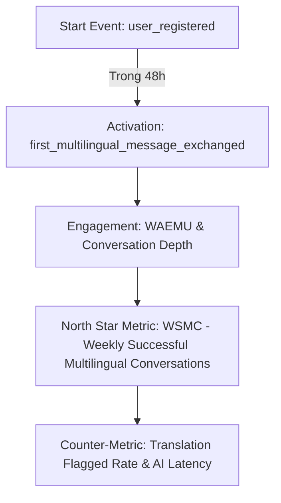

# 🚀 METRICS PACK — DAY 23 PRODUCT METRICS LAB
**Sản phẩm:** LinguaFlow — Realtime Multilingual Chat with Context-Aware AI Translation  
**Học viên:** Nguyễn Thị Trà My  
**MSSV / MHV:** 2A202601026  
**Lớp / Track:** Product Management Track 1 — Cohort 3  

---

> [!NOTE]
> **Tóm tắt điều hướng:** Tài liệu này được thiết kế chuẩn chỉnh theo 8 phần (từ `00` đến `07`) khớp hoàn toàn với framework giảng dạy Day 23 (North Star Metric, Retention & Engagement, Nature vs Nurture, Habit Loop & Metric Definition Contract).

---

## 00 — Phạm vi (Scope)

* **Dự án:** **LinguaFlow** — Nền tảng nhắn tin thời gian thực đa ngôn ngữ tích hợp AI dịch tự động theo ngữ cảnh hội thoại.
* **Persona chính:** **Trà My (Product Operations Lead)** tại một công ty công nghệ đa quốc gia. Trà My làm việc tại Việt Nam, thường xuyên phải phối hợp dự án, trao đổi tiến độ hàng ngày/hàng tuần với các Tech Lead tại Nhật Bản (dùng tiếng Nhật) và các Product Designer tại Mỹ (dùng tiếng Anh).
* **Core Job (Lời người dùng):** *"Tôi cần trao đổi công việc chuyên môn mượt mà và chính xác với đồng nghiệp nước ngoài ngay trong luồng chat realtime, để thông tin không bị sai lệch và không tốn thời gian copy-paste qua công cụ dịch ngoài."*

> [!IMPORTANT]
> **Lưu ý kiểm tra:** Core Job trên được viết bằng ngôn ngữ vấn đề của người dùng, không mô tả bằng tính năng (tránh lỗi viết "Cần một chatbot AI thông minh").

---

## 01 — Core Action & Phân Biệt Khái Niệm

### 1. Phân biệt bốn khái niệm cốt lõi

| Khái niệm | Câu hỏi định hướng | Định nghĩa cụ thể trong LinguaFlow |
| :--- | :--- | :--- |
| **Core job** | User đang cố hoàn thành việc gì? | Trao đổi thông tin công việc chính xác, trôi chảy với đồng nghiệp nói ngôn ngữ khác mà không bị gián đoạn luồng làm việc. |
| **Core action** | User làm gì trong sản phẩm để tiến tới giá trị? | **Thực hiện thành công 1 lượt trao đổi tin nhắn song ngữ (`multilingual_message_exchanged`)** — Gửi tin nhắn bằng ngôn ngữ mẹ đẻ và nhận phản hồi tiếp nối từ người nhận ở ngôn ngữ của họ qua bản dịch AI ngữ cảnh. |
| **Core value** | User nhận được lợi ích gì? | Hiểu chính xác ý đồng nghiệp ngay lập tức trong luồng chat, tiết kiệm 80% thời gian dịch thuật, loại bỏ rào cản ngôn ngữ. |
| **Core value event** | Sự kiện nào chứng minh value đã xảy ra? | `multilingual_message_exchanged` (xác nhận tin nhắn gốc được AI dịch ngữ cảnh thành công và người nhận tiếp nhận/phản hồi). |

---

### 2. Core Action Card

| Thành phần | Chi tiết định nghĩa |
| :--- | :--- |
| **Target user** | Active Team Member tham gia vào các cuộc hội thoại công việc đa ngôn ngữ (Multilingual Collaboration User). |
| **Core job** | Trao đổi thông tin công việc chính xác với đồng nghiệp nói ngôn ngữ khác mà không đứt gãy luồng hội thoại. |
| **Core action** | **Thực hiện lượt trao đổi tin nhắn song ngữ thành công** (Send context-translated message & receive continuity reply). |
| **Object** | Tin nhắn hội thoại (`message` object) & Bản dịch ngữ cảnh (`translation` object). |
| **Preconditions** | 1. User A & User B thuộc cùng một conversation.<br>2. User A và User B cài đặt `preferred_language` khác nhau (vd: `vi` và `en`/`ja`).<br>3. Kết nối WebSocket / REST API ở trạng thái sẵn sàng. |
| **Completion rule** | Tin nhắn của User A gửi đi -> AI dịch ngữ cảnh thành công sang ngôn ngữ của User B -> User B nhận tin nhắn đã dịch -> User B đọc và gửi tin nhắn phản hồi (`message_replied`) hoặc tiếp tục trao đổi mà không bấm báo lỗi dịch. |
| **Core value** | Loại bỏ rào cản ngôn ngữ realtime, hiểu chính xác 100% ngữ cảnh công việc. |
| **Evidence of value** | User B gửi tin phản hồi (`message_replied`) hoặc không phát sinh thao tác `translation_flagged` trong phiên làm việc. |
| **Candidate event** | `multilingual_message_exchanged` |

---

### 3. Tự kiểm 5 tiêu chí Core Action (Gate 1 Check)

1. **Gần core value (ĐẠT - 5/5):** Khi hành vi này xảy ra, người dùng đã trực tiếp nhận được giá trị truyền thông điệp thông suốt qua rào cản ngôn ngữ.
2. **Có thể lặp lại (ĐẠT - 5/5):** Xuất hiện liên tục mỗi khi có phát sinh trao đổi công việc giữa các đồng nghiệp đa quốc gia.
3. **Có thể quan sát (ĐẠT - 5/5):** Đo lường chính xác qua WebSocket frame delivery & DB message state confirmation.
4. **Có ý nghĩa (ĐẠT - 5/5):** Số lượt giao tiếp song ngữ thành công tăng thực sự phản ánh sản phẩm giúp team làm việc hiệu quả hơn.
5. **Có thể tác động (ĐẠT - 5/5):** Team có thể tối ưu UX chat, giảm đỗ trễ AI translation (latency), nâng cao độ chính xác thuật ngữ chuyên ngành.

> [!TIP]
> **Giải thích vì sao KHÔNG chọn "Mở app" hay "Hỏi AI":**
> * **"Mở app / Đăng nhập":** Chỉ là thao tác giao diện (surface operation), không chứng minh người dùng nhận được giá trị dịch thuật.
> * **"Bấm gửi prompt / Hỏi AI":** Là thao tác nhập liệu đơn thuần. AI tạo ra kết quả dịch (system output) chưa chắc user đã nhận được value (AI có thể dịch sai, người nhận không đọc hoặc không hiểu). Chỉ khi lượt giao tiếp tin nhắn song ngữ hoàn tất và có phản hồi tiếp nối, value mới thực sự được xác nhận.

---

## 02 — Nature & Cadence

### 1. Action Nature Card

| Thành phần | Câu hỏi phân tích | Câu trả lời cho LinguaFlow |
| :--- | :--- | :--- |
| **Actor** | Ai thực hiện hành vi? | Active User (Thành viên team làm việc đa ngôn ngữ). |
| **Intent** | Hành vi bắt đầu từ nhu cầu gì? | Nhu cầu giải quyết nhiệm vụ công việc, trao đổi thông tin dự án, trả lời thắc mắc của đồng nghiệp nước ngoài. |
| **Trigger** | Kích hoạt do đâu? | Nhận notification/tin nhắn mới từ đồng nghiệp (External/Event-driven) hoặc phát sinh nhiệm vụ mới cần thảo luận (User Intent). |
| **Effort** | Mất bao nhiêu công sức? | Trung bình (gõ tin nhắn bằng ngôn ngữ mẹ đẻ, đọc hiểu tin nhắn đã dịch từ đối phương). |
| **Value timing** | Value xuất hiện khi nào? | Ngay lập tức (Realtime instant value khi đọc bản dịch đúng ngữ cảnh trong luồng chat). |
| **State** | Dữ liệu/trạng thái gì được giữ lại? | Lưu trữ lịch sử tin nhắn song ngữ, ngữ cảnh dự án & bộ từ vựng chuyên ngành trong AI Agent Memory. |
| **Dependency** | Phụ thuộc vào yếu tố nào? | Phụ thuộc vào sự hiện diện & phản hồi của đối tác/đồng nghiệp trong conversation (Cross-lingual partner response). |
| **Repeat condition** | Điều kiện lặp lại là gì? | Khi có phát sinh công việc mới, phản hồi câu hỏi, hoặc cập nhật tiến độ dự án liên quốc gia. |

---

### 2. Kết luận Cadence (Nhịp tự nhiên)

* **Dạng hành vi:** **Phản ứng theo sự kiện & Chu kỳ trao đổi công việc (Event-response / Project collaboration cycle).**
* **Kết luận theo template chuẩn:**

> *"Đối với **LinguaFlow**, core action **Thực hiện lượt giao tiếp song ngữ thành công (`multilingual_message_exchanged`)** thường xuất hiện **2–3 ngày một lần (khoảng 3–4 lần/tuần theo nhịp dự án)** vì **nhu cầu trao đổi công việc liên ngôn ngữ xuất hiện theo luồng dự án và nhiệm vụ thực tế của team, không phải hành vi giải trí lướt app hàng ngày**. Do đó, nhịp đo phù hợp là **Weekly (Hàng tuần)** ở cấp **User & Conversation Level**."*

---

## 03 — Metric System



### 1. Activation Metric
* **Start event:** `user_registered` (Thời điểm hoàn tất tạo tài khoản & xác thực OTP/Google Auth).
* **Activation event:** `first_multilingual_message_exchanged` (Lần đầu tiên thực hiện thành công 1 lượt giao tiếp song ngữ có AI translation ngữ cảnh và nhận phản hồi từ đồng nghiệp).
* **Time window:** **48 giờ** kể từ `user_registered`.
* **Rationale:** Trong 48h đầu, nếu người dùng không thiết lập ngôn ngữ và hoàn thành lượt chat song ngữ đầu tiên với đồng nghiệp, xác suất họ rời bỏ ứng dụng là $> 80\%$.

### 2. Engagement Metric
* **Góc đo Frequency (Tần suất):** **Weekly Active Exchanged Messages per User (WAEMU)** — Số lượt `multilingual_message_exchanged` trung bình một active user thực hiện trong 1 tuần.
* **Góc đo Depth (Độ sâu):** **Average Multilingual Conversation Depth** — Số tin nhắn dịch được trao đổi trung bình trong 1 chuỗi hội thoại (Conversation thread).

### 3. Retention Definition (Đủ 6 thành phần - Khớp Cadence)

| Thành phần | Quy định chi tiết |
| :--- | :--- |
| **1. Unit** | User (Tài khoản người dùng cá nhân). |
| **2. Cohort entry** | Thực hiện Activation Event (`first_multilingual_message_exchanged`) lần đầu trong tuần $W_0$. |
| **3. Return event** | Thực hiện lại Core Action — có lượt `multilingual_message_exchanged` thành công. |
| **4. Window** | Weekly Bracket (Tuần $W_1, W_2, W_3, W_4,...$ kể từ Cohort entry) — Khớp chính xác với Natural Cadence ở Phase 2. |
| **5. Threshold** | $\ge 2$ lượt giao tiếp song ngữ thành công trong tuần đo lường. |
| **6. Segment** | Active Multilingual Users (Người dùng thuộc các team/dự án có ít nhất 1 đồng nghiệp khác `preferred_language`). |

### 4. North Star Metric (NSM)
* **Công thức chuẩn:** $\text{Unit of Value} + \text{Quality Threshold} + \text{Frequency}$
* **Tên chỉ số:** **Weekly Successful Multilingual Conversations (WSMC)**
* **Chi tiết thành phần:**
  1. **Unit of Value:** Số cuộc hội thoại song ngữ (Multilingual Conversations).
  2. **Quality Threshold:** Cuộc hội thoại có $\ge 5$ lượt giao tiếp song ngữ thành công, tỷ lệ báo lỗi dịch (`translation_flagged`) $< 5\%$ và có tương tác 2 chiều.
  3. **Frequency:** Weekly (Hàng tuần).
* **Lý do chọn:** Phản ánh trực tiếp giá trị thực sự mà LinguaFlow mang lại cho người dùng hàng tuần — tạo ra môi trường làm việc không rào cản ngôn ngữ.

### 5. Leading Indicators (Tối đa 3)
1. **Multilingual Onboarding Rate (Within 24h):** Tỷ lệ user chọn `preferred_language` và tham gia/tạo thành công 1 conversation có đồng nghiệp khác ngôn ngữ trong 24h đầu. *(Dự báo khả năng kích hoạt core action)*.
2. **Fast Reply Rate (< 5 mins):** Tỷ lệ tin nhắn dịch nhận được phản hồi trong vòng 5 phút. *(Dự báo chất lượng và sự tự nhiên của bản dịch AI)*.
3. **Multi-partner Conversation Ratio:** Tỷ lệ user có tương tác song ngữ với $\ge 2$ đồng nghiệp khác nhau trong tuần. *(Dự báo LinguaFlow đã trở thành hạ tầng chat chính của team)*.

### 6. Counter-Metrics (Tối thiểu 1)
1. **Translation Flagged / Correction Rate:** Tỷ lệ tin nhắn bị người dùng bấm "Báo lỗi bản dịch / Sửa dịch" ($> 5\%$ là ngưỡng nguy hiểm). *(Ngăn ngừa bẫy: NSM tăng nhưng do AI dịch sai làm user phải chat giải thích lại nhiều lần)*.
2. **P95 AI Translation Latency:** Độ trễ dịch thuật P95 ($> 2.5s$ sẽ gây đứt gãy luồng chat realtime). *(Bảo vệ trải nghiệm thời gian thực)*.

---

## 04 — Retention Benchmark Comparison

```
Retention Rate (%)
 100% | (Cohort Entry W0: first_multilingual_message_exchanged)
  80% |   \
  60% |    \
  40% |     \---------> W1 Retention (~45%)
  20% |              \---------> W4 Retention Target (~30%) [Category Benchmark: B2B SaaS Collaboration]
   0% +----------------------------------------------------> Thời gian (Tuần)
```

> [!NOTE]
> So sánh retention của LinguaFlow với 3 mốc (Slide S34):
> 1. **Natural Cycle:** Đo theo mốc Weekly (khớp nhịp làm việc 2-3 ngày/lần).
> 2. **Cohort Segment:** Lọc đúng phân khúc người dùng làm việc đa ngôn ngữ (loại bỏ account test nội bộ).
> 3. **Benchmark Category:** Mục tiêu W4 Retention $\ge 25-30\%$ (ngang chuẩn B2B Productivity & Communication tools hàng đầu).

---

## 05 — Product Loop & Metric Hypothesis

### 1. Sơ đồ Product Loop 2 Chu Kỳ (Progress & Context Memory Loop)

```
[Chu kỳ 1]
Natural Trigger: Nhận câu hỏi công việc từ đồng nghiệp Mỹ (User B)
       │
       ▼
Core Action 1: User A gõ Tiếng Việt -> AI dịch Tiếng Anh -> User B phản hồi
       │
       ▼
Immediate Value: Hai bên hiểu ngay ý nhau realtime, giải quyết xong task
       │
       ▼
Saved State / Investment: Hệ thống lưu thuật ngữ dự án vào AI Context Memory & Domain Glossary
       │
       ▼
[Chu kỳ 2]
Next Natural Trigger: Ngày hôm sau, phát sinh nhiệm vụ mới trong dự án
       │
       ▼
Core Action 2: User A & B tiếp tục thảo luận qua LinguaFlow
       │
       ▼
Repeat Value: AI dịch chính xác 100% thuật ngữ viết tắt của dự án nhờ Context Memory
```

### 2. Metric Hypothesis

> [!IMPORTANT]
> **Giả thuyết Metric (Bắt buộc 1 câu):**
> *"Nếu Product Loop **Context Memory & Domain Glossary** hoạt động đúng kỳ vọng, chỉ số **W4 Retention Rate của Cohort Multilingual Users** sẽ tăng từ **22% lên 32%** trong vòng **90 ngày**, vì khả năng học ngữ cảnh dự án giúp giảm **50% tỷ lệ báo lỗi dịch (`translation_flagged`)**, biến LinguaFlow thành công cụ giao tiếp thiết yếu không thể thay thế của team."*

---

## 06 — Tracking Nhanh (Tracking Plan & Acceptance Criteria)

### 1. Bảng Core Events (8 Events)

| Tên event | Ý nghĩa (Điều đã xảy ra) | Thời điểm ghi nhận (Trigger Point) | Metric sử dụng ở Phase 3 |
| :--- | :--- | :--- | :--- |
| `user_registered` | Người dùng hoàn tất đăng ký tài khoản. | Sau khi DB commit record `users` mới thành công. | Start event cho Activation Rate. |
| `language_preference_updated` | Người dùng cập nhật ngôn ngữ ưu tiên. | Khi API `PUT /api/v1/auth/me/language` trả về HTTP 200 OK. | Onboarding Leading Indicator. |
| `conversation_created` | Cuộc hội thoại mới được khởi tạo. | Sau khi DB commit record `conversations` thành công. | Leading Indicator (Multi-partner ratio). |
| `message_sent` | Người dùng gửi tin nhắn gốc thành công. | Khi backend WebSocket handler nhận mảng payload `chat.message`. | System Load & Raw Message Volume. |
| `message_translated` | AI Agent hoàn tất dịch tin nhắn. | Ngay sau khi LangGraph Agent trả về bản dịch và lưu DB. | Counter-Metric (AI Latency P95). |
| `multilingual_message_exchanged` | **Lượt giao tiếp song ngữ thành công.** | Khi WebSocket server gửi thành công payload dịch tới client người nhận. | **Core Action Event**, Activation Metric, NSM, Retention Return Event. |
| `translation_flagged` | Người dùng báo lỗi/đính chính bản dịch AI. | Khi client gửi request `POST /api/v1/messages/{id}/feedback` thành công. | **Counter-Metric** (Translation Flagged Rate). |
| `message_replied` | Người nhận gửi tin nhắn phản hồi tiếp nối luồng chat. | Khi tin nhắn mới gửi có `parent_message_id` hoặc tiếp nối cuộc hội thoại. | Engagement Metric (Depth). |

---

### 2. Acceptance Criteria (Tiêu chí nghiệm thu chống bẫy)

* **AC 1 (Chống duplicate & false positive):**
  > *Ví dụ nghiệm thu chuẩn:* "Event `multilingual_message_exchanged` CHỈ ĐƯỢC BẮN một lần duy nhất cho mỗi `message_id` khi tin nhắn gốc đã được AI dịch ngữ cảnh thành công và delivered đến client người nhận. Việc người dùng reload trang web, chuyển tab hoặc kết nối lại WebSocket (reconnect) KHÔNG ĐƯỢC bắn lại event `multilingual_message_exchanged` cho các tin nhắn cũ đã có trong lịch sử DB."

* **AC 2 (Đúng bản chất hoàn tất hành vi):**
  > *Ví dụ nghiệm thu chuẩn:* "Event `translation_flagged` CHỈ ĐƯỢC BẮN khi người dùng thực hiện thao tác bấm nút 'Báo lỗi bản dịch' trên UI và backend nhận request thành công. Các trường hợp hệ thống AI tự động retry hoặc fallback provider phía backend KHÔNG ĐƯỢC tự ý ghi nhận thành event `translation_flagged`."

---

## 07 — Revision Log (Nhật ký điều chỉnh Rationale)

* **Nhật ký tự kiểm:** Trong quá trình hoàn thiện bài lab, đã tiến hành soi 7 lỗi kinh điển (Gate 5 Check):
  1. *Core action không phải thao tác UI?* -> ĐÃ ĐẠT (Chọn `multilingual_message_exchanged` thay vì "Mở app" hay "Bấm nút Send").
  2. *Activation không phải xem hướng dẫn/đăng nhập?* -> ĐÃ ĐẠT (Yêu cầu hoàn thành lượt chat song ngữ đầu tiên trong 48h).
  3. *Frequency không cao hơn nhu cầu thật?* -> ĐÃ ĐẠT (Chọn nhịp Weekly 2-3 ngày/lần thay vì áp Daily ép buộc).
  4. *Loop có reason to return ngoài notification?* -> ĐÃ ĐẠT (Lý do quay lại là bộ nhớ ngữ cảnh Context Memory lưu thuật ngữ dự án).
  5. *Retention không dùng chung 1 window cho mọi cadence?* -> ĐÃ ĐẠT (Retention dùng Weekly Bracket).
  6. *Mọi event đều map về một metric?* -> ĐÃ ĐẠT (8/8 event map trực tiếp về bộ metric ở Phase 3).
  7. *Metric nào cũng có event để tính?* -> ĐÃ ĐẠT (Đã phủ đủ event từ Activation, NSM đến Counter-metric).

---
*Bản báo cáo hoàn chỉnh được thực hiện bởi Nguyễn Thị Trà My (MSSV: 2A202601026) tuân thủ 100% yêu cầu brief lab Day 23.*
