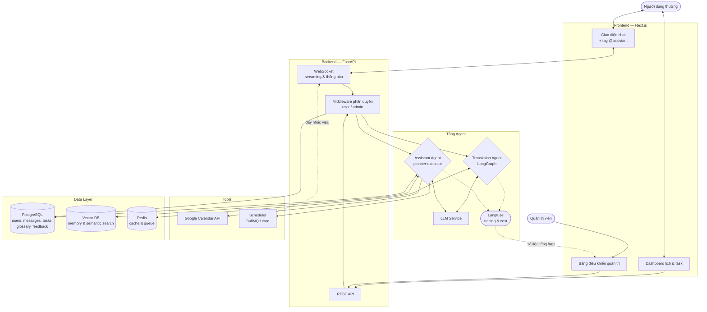
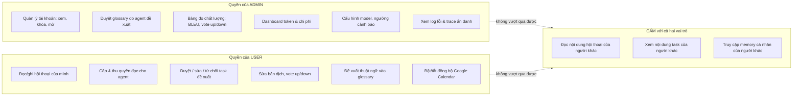
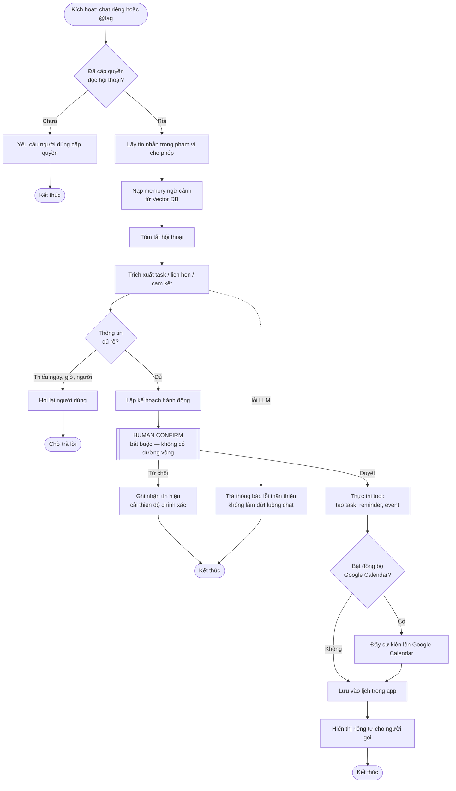
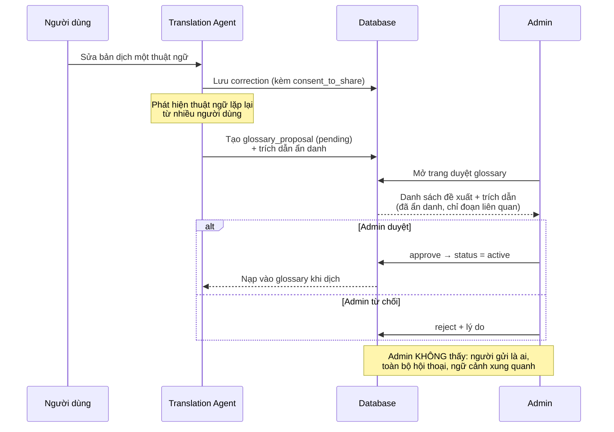
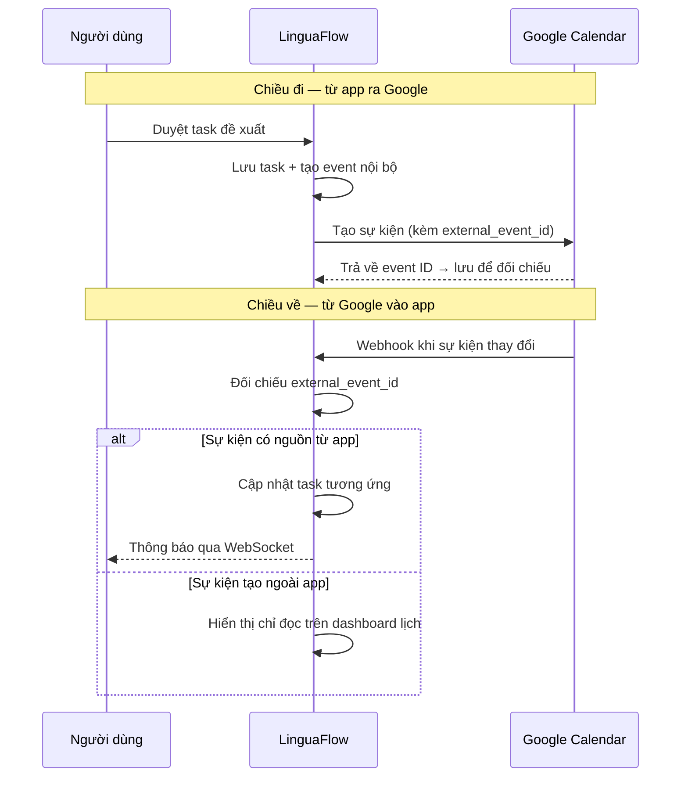
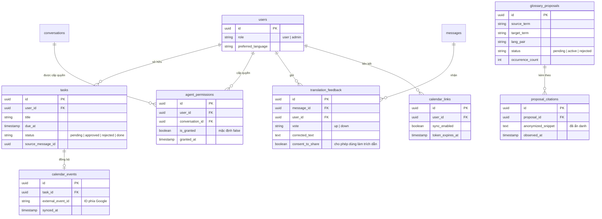
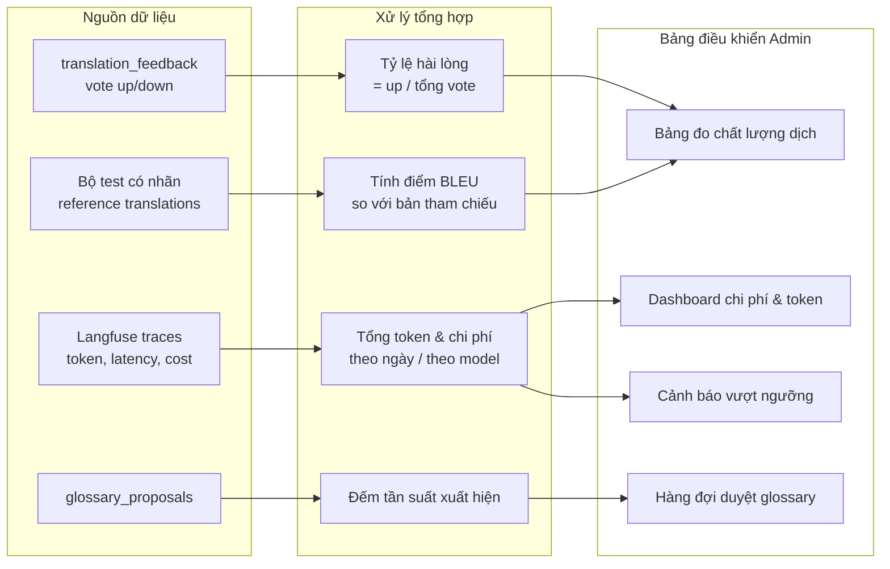

# Thiết kế hệ thống — Role Admin & Agent Trợ lý

**Nhóm 4U (P-217)** — bổ sung cho `ARCHITECTURE.md` và `docs/architecture_diagram.md`

---

## PHẦN I — MÔ TẢ AGENT TRỢ LÝ MỚI

### 1.1 Định vị

**Assistant Agent** là agent thứ hai trong hệ thống, chạy song song với Translation Agent đã có. Hai agent độc lập về luồng xử lý, dùng chung tầng hạ tầng (auth, DB, WebSocket, observability).

| | Translation Agent (đã có) | Assistant Agent (mới) |
|---|---|---|
| Kích hoạt | Tự động, mọi tin nhắn | Theo yêu cầu (chat riêng / tag trong nhóm) |
| Đầu ra | Bản dịch, hiển thị cho mọi người | Tóm tắt & task, **chỉ người gọi thấy** |
| Tính chất | Đồng bộ, độ trễ thấp | Bất đồng bộ, chấp nhận độ trễ cao hơn |
| Ghi dữ liệu | Không tạo bản ghi mới | Tạo task, event, memory |

### 1.2 Hai chế độ xuất hiện

**Chế độ A — Hội thoại cá nhân với agent**

Agent xuất hiện như một liên hệ trong danh sách hội thoại (tương tự "Khánh Thi", "Report dự án" hiện có). Người dùng chat trực tiếp: yêu cầu tóm tắt, hỏi việc cần làm, xem lịch. Đây là không gian riêng tư hoàn toàn.

**Chế độ B — Tag trong nhóm**

Người dùng gõ `@assistant` trong group chat để nhờ việc ngay tại chỗ ("@assistant tóm tắt 50 tin vừa rồi", "@assistant nhắc tôi việc này thứ 5").

**Ràng buộc quan trọng:** phản hồi của agent trong nhóm là **tin nhắn riêng tư (ephemeral)** — chỉ người tag nhìn thấy, các thành viên khác trong nhóm không thấy gì cả. Về mặt kỹ thuật đây không phải tin nhắn nhóm thật, mà là bản ghi có `visibility = 'private'` và `visible_to_user_id = <người tag>`, chỉ render phía client của người đó.

Lý do thiết kế: nếu agent trả lời công khai, nội dung tóm tắt (có thể chứa suy luận về cam kết của người khác) sẽ lộ ra cho cả nhóm — vừa gây phiền, vừa vi phạm quyền riêng tư của những người chưa cấp phép.

### 1.3 Vòng đời của một task

```
Agent phát hiện → Task đề xuất (pending) → User duyệt/sửa/từ chối
                                          → [duyệt] → Task đã xác nhận
                                                    → Vào Dashboard lịch trong app
                                                    → [nếu bật] Đồng bộ Google Calendar
                                          → [từ chối] → Lưu làm tín hiệu cải thiện độ chính xác
```

Không có task nào tự động vào lịch. Đây là ràng buộc human-in-the-loop bắt buộc của đề bài.

---

## PHẦN II — CÁC SƠ ĐỒ HỆ THỐNG

### Sơ đồ 1 — Kiến trúc tổng thể sau khi thêm role Admin và Assistant Agent



### Sơ đồ 2 — Phân quyền: ranh giới metadata vs nội dung



### Sơ đồ 3 — Luồng Assistant Agent (LangGraph)



### Sơ đồ 4 — Luồng duyệt glossary do agent đề xuất



### Sơ đồ 5 — Đồng bộ hai chiều với Google Calendar



### Sơ đồ 6 — ER các bảng mới



### Sơ đồ 7 — Nguồn dữ liệu cho bảng điều khiển quản trị



---

## PHẦN III — GHI CHÚ THIẾT KẾ

### 3.1 Vấn đề trích dẫn trong glossary — cần xử lý trước khi code

Yêu cầu "có trích dẫn để admin kiểm tra" mâu thuẫn trực tiếp với ràng buộc riêng tư (agent chỉ xử lý trong vùng đã giải mã, admin không đọc nội dung người dùng). Ba phương án, xếp theo mức độ an toàn:

| Phương án | Cách làm | Đánh giá |
|---|---|---|
| **A — Opt-in tường minh** *(đề xuất)* | Khi user sửa bản dịch, hỏi "Cho phép dùng bản sửa này để cải thiện hệ thống?". Chỉ correction có `consent_to_share = true` mới được dùng làm trích dẫn | An toàn nhất, minh bạch với người dùng, dễ giải thích khi bảo vệ |
| **B — Trích dẫn tối giản** | Chỉ hiện cụm từ chứa thuật ngữ (5–10 từ), ẩn danh người gửi, không hiện ngữ cảnh xung quanh | Chấp nhận được nếu kết hợp với A |
| **C — Không trích dẫn** | Admin chỉ thấy cặp thuật ngữ + số lần xuất hiện + tỷ lệ được người dùng chọn | An toàn tuyệt đối nhưng admin khó thẩm định |

Thiết kế trong sơ đồ 4 và bảng ER ở trên áp dụng **A + B kết hợp**: cần cả `consent_to_share` lẫn `anonymized_snippet`.

### 3.2 Về điểm BLEU — lưu ý khi triển khai

BLEU cần **bản dịch tham chiếu** để so sánh, không tự tính ra từ dữ liệu chạy thật. Với phạm vi 5 ngày, phương án thực tế:

- Xây bộ test nhỏ (50–100 câu) có bản dịch chuẩn do người trong nhóm hoặc dịch giả xác nhận
- Chạy định kỳ (không realtime), hiển thị điểm BLEU theo từng lần chạy để thấy xu hướng
- Hiển thị kèm **tỷ lệ vote up/down** — chỉ số này lấy từ người dùng thật, phản ánh chất lượng cảm nhận, bổ khuyết cho hạn chế của BLEU (BLEU phạt các bản dịch đúng nghĩa nhưng khác cách diễn đạt)

Đừng để dashboard chỉ có mỗi BLEU — với dịch hội thoại, hai chỉ số này nói hai chuyện khác nhau.

### 3.3 Tin nhắn riêng tư trong nhóm — điểm cần test kỹ

Cơ chế `visibility = 'private'` là chỗ dễ rò rỉ nhất. Cần test:
- Thành viên khác load lại lịch sử hội thoại → không thấy tin của agent
- Thành viên khác dùng chức năng tìm kiếm trong hội thoại → không tìm ra
- API trả về danh sách tin nhắn đã lọc **ở tầng backend**, không dựa vào frontend ẩn đi

Lọc ở frontend là lỗi bảo mật kinh điển — dữ liệu vẫn đi qua mạng, mở DevTools là thấy.

### 3.4 Việc cần chốt trong `CONTRACT.md` trước khi code

- Tên các event WebSocket mới: `assistant_response`, `task_proposed`, `task_confirmed`, `reminder_due`
- Enum trạng thái task: `pending | approved | rejected | done`
- Enum trạng thái glossary: `pending | active | rejected`
- Trường `visibility` và `visible_to_user_id` trong bảng `messages`
- Format payload của task đề xuất (agent → FE)