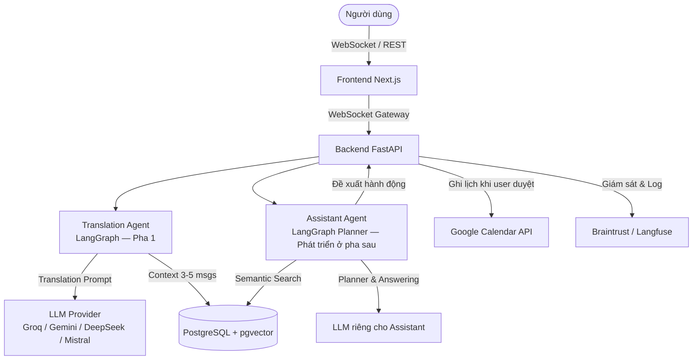

# Deliverable #3: Kiến trúc Hệ thống (Architecture Diagram & Specification)

**Dự án:** LinguaFlow (P-217) · **Nhóm thực hiện:** 4U  
**Thành phần chính:** Translation Agent (Pha 1) & Assistant Agent (phát triển bổ sung ở pha sau này).

Tài liệu này tổng hợp thiết kế kiến trúc hệ thống LinguaFlow. Chi tiết sơ đồ Mermaid đầy đủ nằm tại [`docs/architecture_diagram.md`](architecture_diagram.md) và danh sách các quyết định kiến trúc (ADR-01 đến ADR-39) nằm tại [`ARCHITECTURE.md`](../ARCHITECTURE.md).

---

## 1. Tổng quan Kiến trúc (System Architecture)

LinguaFlow vận hành theo mô hình micro-agentic monolith trên FastAPI + Next.js, tích hợp hai Agent đồ thị LangGraph riêng biệt cho hai vai trò:

1. **Translation Agent (Pha 1)**: Dịch thuật tin nhắn real-time đa ngôn ngữ, duy trì ngữ cảnh 3-5 tin nhắn gần nhất, tự động nhận diện ngôn ngữ và dự phòng đa tầng (ADR-01 đến ADR-29).
2. **Assistant Agent (Phát triển bổ sung ở pha sau này)**: Trợ lý AI cá nhân trợ giúp trích xuất cam kết, lập đề xuất sự kiện/lịch hẹn với Human-in-the-Loop approval, nhắc nhở nhiệm vụ, trả lời câu hỏi qua RAG ngữ nghĩa riêng trên `assistant_chunks` và đồng bộ 2 chiều với Google Calendar (ADR-30 đến ADR-39).

---

## 2. Các Đồ thị Kiến trúc Chi tiết

- **Sơ đồ Kiến trúc & Luồng dữ liệu (Mermaid 6 sơ đồ)**: [`docs/architecture_diagram.md`](architecture_diagram.md)
  - §1 System Overview
  - §2 Agent Flow (Luồng xử lý dịch thuật & Luồng lập kế hoạch trợ lý)
  - §3 Data Flow (WebSocket, DB Persistence, RAG Indexing)
  - §4 ER Diagram (Cơ sở dữ liệu PostgreSQL + pgvector)
  - §5 Sequence Diagram (Luồng dịch tin nhắn & Luồng tạo lịch hẹn sau duyệt)
  - §6 Use Case Diagram (Use Cases UC-01..UC-08 cho dịch thuật, UC-09..UC-16 cho Assistant Agent)

- **Các quyết định kiến trúc cốt lõi (ADRs)**: [`ARCHITECTURE.md`](../ARCHITECTURE.md)
  - **ADR-11**: Two-tier language detection (langdetect local ~2ms + LLM arbitration).
  - **ADR-22**: Chuẩn hoá PostgreSQL + extension `pgvector` cho mọi môi trường.
  - **ADR-30**: Mô hình phân quyền Human-in-the-Loop cho Assistant Agent (chỉ ghi lịch sau khi người dùng phê duyệt).
  - **ADR-37**: Kho RAG riêng `assistant_chunks` và mô hình nhúng riêng cho Assistant Agent.

---

## 3. Liên kết Liên quan
- [Tài liệu Thiết kế Chi tiết (ARCHITECTURE.md)](../ARCHITECTURE.md)
- [Bộ 6 Sơ đồ Mermaid (docs/architecture_diagram.md)](architecture_diagram.md)
- [Đặc tả API Contract (docs/CONTRACT.md)](CONTRACT.md)
