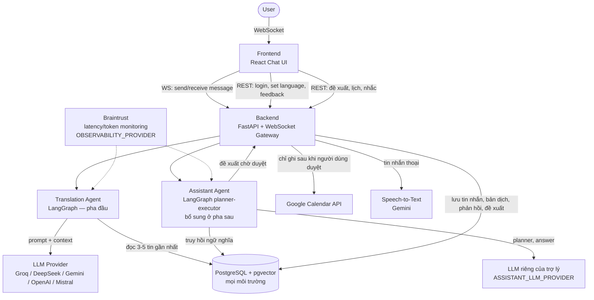
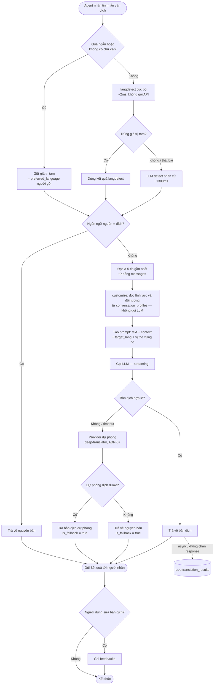
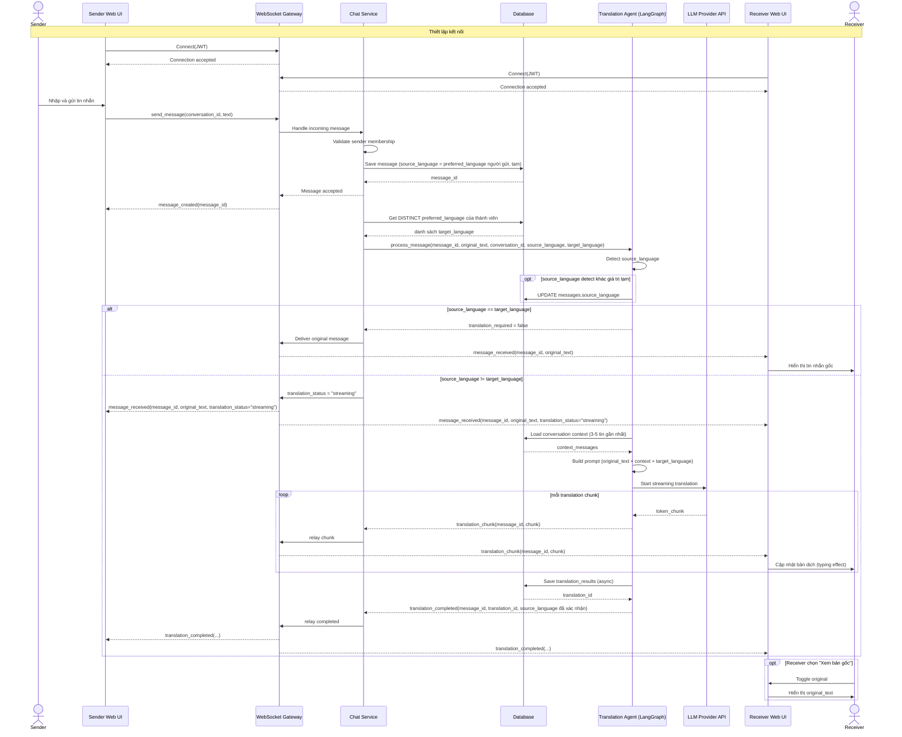
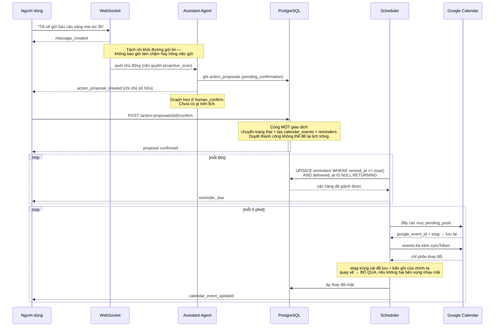
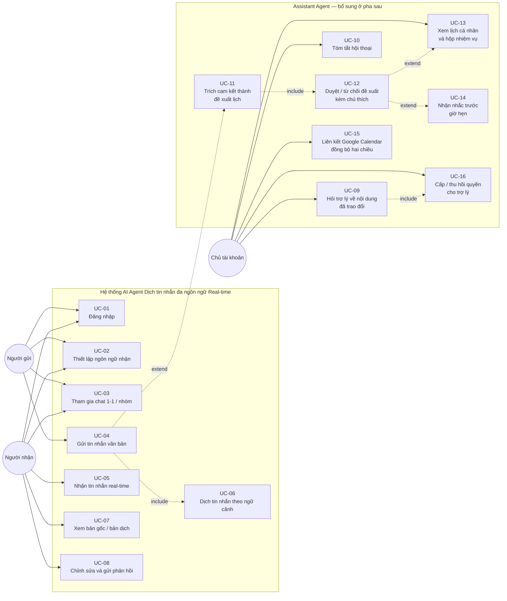

# SƠ ĐỒ KIẾN TRÚC HỆ THỐNG

**Dự án:** LinguaFlow (P-217) · **Nhóm thực hiện:** 4U
**Phiên bản:** 1.0 · **Ngày cập nhật:** 10/08/2026 · **Trạng thái:** Đang áp dụng

Tài liệu này chứa các sơ đồ kiến trúc dưới dạng Mermaid. Mô tả thành phần và căn cứ lựa chọn thiết kế: xem [`ARCHITECTURE.md`](../ARCHITECTURE.md).

| Mục | Sơ đồ | Phạm vi mô tả |
|---|---|---|
| §1 | System Overview | Thành phần hệ thống và quan hệ giữa các tầng |
| §2 | Agent Flow | Luồng xử lý bên trong AI Agent |
| §3 | Data Flow | Luồng dữ liệu giữa các tiến trình và kho dữ liệu |
| §4 | ER Diagram | Cấu trúc cơ sở dữ liệu |
| §5 | Sequence Diagram | Trình tự tương tác giữa các tầng theo thời gian |
| §6 | Use Case Diagram | Chức năng hệ thống theo góc nhìn người dùng |

---

## 1. System Overview



Hệ thống dùng **một nguồn dữ liệu duy nhất** (`DB`) cho cả bốn vai trò: lưu lịch sử hội thoại, cung cấp ngữ cảnh cho agent dịch, chứa index vector, và lưu đề xuất cùng lịch của agent trợ lý. Vector store nằm ngay trong PostgreSQL qua `pgvector` chứ không phải dịch vụ rời (ADR-22); điều này **thay thế ADR-01**, vốn loại vector store khỏi phạm vi MVP — xem ADR-26 và ADR-27 trong [`ARCHITECTURE.md`](../ARCHITECTURE.md). SQLite không còn chạy được vì schema có cột `vector`.

Hai agent dùng đồ thị riêng và cấu hình mô hình riêng. Đường tới Google Calendar đi qua Backend chứ không đi thẳng từ agent: agent chỉ **đề xuất**, việc ghi chỉ xảy ra sau khi người dùng duyệt (ADR-30, ADR-34).

## 2. Agent Flow



**Đặc điểm kiến trúc của Agent Flow:**

1. Hệ thống không sử dụng Vector Store riêng; bước "Đọc 3-5 tin gần nhất" truy vấn trực tiếp bảng `messages`, do ngữ cảnh là cửa sổ trượt theo thời gian (ADR-01).
2. Bước xác định ngôn ngữ nguồn sử dụng chiến lược hai tầng: `langdetect` cục bộ trước, chỉ gọi LLM phân xử khi có mâu thuẫn (ADR-11).
3. Nhánh fallback xử lý theo cơ chế hai tầng: khi LLM lỗi hoặc bản dịch không hợp lệ, Agent gọi provider dự phòng `deep-translator` (ADR-07); nếu provider dự phòng cũng thất bại thì trả về nguyên bản kèm `is_fallback = true`.
4. Bước "Bản dịch hợp lệ?" bao gồm cả kiểm tra ngôn ngữ đầu ra bằng `langdetect` cục bộ, không chỉ kiểm tra độ dài (ADR-13). Ngoài ra hai bước không vẽ trong sơ đồ vì không rẽ nhánh: giới hạn kích thước `original_text` và kiểm tra dạng `target_language` chạy trước khi tạo prompt, còn từng dòng ngữ cảnh được làm sạch bên trong bước "Tạo prompt" (ADR-12). Chi tiết: `ARCHITECTURE.md` §5.2.

**Chi phí mỗi tin nhắn theo nhánh:**

| Nhánh | Số lần gọi LLM | Latency đo được (Groq) |
|---|---|---|
| Quá ngắn hoặc chỉ emoji | 0 | ~0ms |
| langdetect trùng, nguồn = đích | 0 | ~2ms |
| langdetect trùng, cần dịch | 1 | ~1501ms |
| langdetect mâu thuẫn, cần dịch | 2 | ~2800ms |
| LLM lỗi, provider dự phòng dịch thay | 1 (thất bại) | phụ thuộc mạng, giới hạn bởi `FALLBACK_TRANSLATOR_TIMEOUT_SECONDS` |

### 2.1. Assistant Agent — planner-executor có cổng người duyệt

Agent thứ hai, chạy song song và độc lập với agent dịch (`docs/NewFeature.md` §1.1).
Khác ba điểm: kích hoạt **theo yêu cầu** chứ không tự động, chấp nhận độ trễ **giây** chứ
không phải mili-giây, và đầu ra là **hàng dữ liệu chờ người duyệt** chứ không phải văn bản
giao ngay.

```mermaid
graph TD
    START([Kích hoạt: @assistant hoặc chat riêng]) --> Perm{Đã cấp quyền<br/>read_conversations?}
    Perm -->|Chưa| Ask[Trả lời bằng lời:<br/>cần bật quyền nào] --> END1([Kết thúc])
    Perm -->|Rồi| Mem[load_memory<br/>cửa sổ thời gian + truy hồi assistant_chunks]
    Mem --> Plan[plan — model riêng của trợ lý<br/>xuất danh sách lời gọi công cụ]
    Plan --> Route{route}

    Route -->|cần hỏi lại| Clar[clarify<br/>đặt câu hỏi ngược] --> END3([Kết thúc])
    Route -->|không việc gì| Resp
    Route -->|có công cụ| Tools[run_tools<br/>chạy theo registry đóng]

    Tools --> After{sau khi chạy}
    After -->|sinh đề xuất| HC[[human_confirm<br/>interrupt&#40;&#41; — treo lượt chạy]]
    After -->|còn lượt replan| Plan
    After -->|đủ rồi| Resp

    HC -->|Command&#40;resume&#41;<br/>duyệt + chú thích| Exec[execute<br/>confirm_proposal kèm sửa và nhắc trước N phút]
    Exec --> Resp[respond] --> END2([Kết thúc])

    style HC fill:#fde68a,stroke:#b45309
    style Tools fill:#dbeafe,stroke:#1d4ed8
```



**`human_confirm` là ràng buộc bắt buộc, không có đường vòng** — không việc nào tới lịch
mà không có người nói đồng ý. Node này gọi `interrupt()` thật của LangGraph, tức là lượt
chạy **treo lại** chứ không phải chỉ ghi một hàng rồi kết thúc.

Điểm cần hiểu đúng: chỗ treo nằm trong checkpointer **trong bộ nhớ tiến trình**, còn thứ
sống sót qua restart là các hàng `action_proposals` mà node đã ghi **trước khi** treo. Mất
chỗ treo thì các hàng vẫn còn, và endpoint duyệt thực thi thẳng từ chúng — một hàm tác
dụng, hai chỗ kích hoạt (ADR-32).

`plan` không được tự do chọn công cụ theo kiểu function-calling: nó xuất lời gọi có cấu
trúc và `run_tools` dispatch qua một **registry là dict trong mã nguồn**, nên tập việc có
thể xảy ra cố định. Tên công cụ lạ bị loại bỏ, vì tra cứu bằng phép bằng và một tên bịa sẽ
không tới đâu — lượt chạy kết thúc trông như thành công mà không làm gì (ADR-40).

**Không công cụ nào ghi thẳng vào lịch.** Thứ muốn đổi lịch thì ghi một hàng
`action_proposals`, đi qua đúng cổng mà một cam kết phát hiện tự động đã đi qua. Đó cũng
là cái cho phép người duyệt **chú thích**: sửa giờ bộ trích xuất đọc nhầm, và chọn nhắc
trước bao nhiêu phút — thứ tin nhắn gốc không bao giờ chứa. Một lần ghi thẳng thì không có
gì để chú thích: tới lúc người ta nhìn thấy, nó đã xảy ra rồi.

Mũi tên `run_tools → plan` là **chu trình duy nhất** trong đồ thị. Nó bị chặn ở
`MAX_REPLANS = 3` trong mã chứ không giao cho model tự đếm lượt: mỗi vòng là một lời gọi
model mà người dùng đang ngồi chờ, và một planner luôn có thể xin thêm một công cụ nữa thì
sẽ xin mãi.


## 3. Data Flow

```mermaid
graph LR
    E1[User] -->|1. Chat message| P1((P1: Receive Message<br/>WebSocket))
    P1 -->|2. Broadcast tin gốc ngay lập tức| E1
    P1 -->|3. Message data| P2((P2: Translation Agent<br/>LangGraph))

    P2 -->|4. Query 3-5 recent messages| DB[(PostgreSQL + pgvector)]
    P2 -->|5. Translation request + prompt| E2[LLM Provider API]
    E2 -->|6. Translation stream| P2

    P2 -->|7. Translated message| E1
    P2 -.8. Async persist.-> P3((P3: Store Data<br/>Background Worker))
    P3 -->|9. Save translation_results| DB

    E1 -->|10. Submit correction| P4((P4: Handle Feedback<br/>REST API))
    P4 -->|11. Save feedbacks| DB
    P4 -.log metrics.-> Monitor[Braintrust]

    P1 -.12. quét nền tìm cam kết.-> P5((P5: Assistant Agent<br/>planner-executor))
    E1 -->|12'. @assistant hoặc chat riêng| P5
    P5 -->|13. truy hồi ngữ nghĩa assistant_chunks| DB
    P5 -->|14. planner + answer| E3[LLM riêng của trợ lý]
    P5 -->|15. action_proposals, một hàng mỗi thành viên| DB
    P5 -->|16. thẻ đề xuất chờ duyệt| E1
    E1 -->|17. duyệt / từ chối + chú thích| P6((P6: Execute<br/>sau cổng người duyệt))
    P6 -->|18. calendar_events, reminders| DB
    P6 -->|19. đẩy lên lịch ngoài| E4[Google Calendar API]
```

**Ghi chú:** chỉ bước lưu bản dịch (bước 9) được thực hiện bất đồng bộ. Tin nhắn gốc được lưu đồng bộ trước khi phát tới các client, do các bước sau yêu cầu `message_id`. Trình tự chi tiết bao gồm cơ chế streaming: xem §5.

Các bước 12–19 thuộc Assistant Agent, **bổ sung ở pha sau**. Điểm cần đọc kỹ là bước 17: không có mũi tên nào đi thẳng từ P5 sang `calendar_events` hay Google Calendar. Mọi ghi ra lịch đều phải qua P6, và P6 chỉ chạy sau khi người dùng duyệt (ADR-30, ADR-34). Bước 12 và 12' là hai lối vào khác nhau — quét nền tự phát hiện cam kết, và người dùng chủ động gọi — nhưng cả hai hội tụ vào cùng một cổng duyệt.

## 4. ER Diagram

```mermaid
erDiagram
    users ||--o{ conversation_members : joins
    users ||--o{ messages : sends
    users ||--o{ feedbacks : gives
    conversations ||--o{ conversation_members : has
    conversations ||--o{ messages : contains
    messages ||--o{ translation_results : translated
    messages ||--o{ translation_attempts : attempted
    translation_results ||--o{ feedbacks : receives
    translation_results |o--o{ translation_attempts : "produced (nullable)"
    users ||--o{ agent_consents : grants
    users ||--o{ calendar_events : owns
    users ||--o{ reminders : owed
    users ||--o| calendar_links : links
    action_proposals |o--o{ calendar_events : "scheduled as (nullable)"
    calendar_events ||--o{ reminders : "nudges"

    action_proposals {
        string id PK
        string owner_user_id FK "một hàng mỗi thành viên — duyệt là quyền riêng từng người"
        string conversation_id FK
        string source_message_id FK
        string source_mode "proactive | mention | private"
        string kind "calendar_event | reminder | task"
        string title "câu người dùng thật sự nói — không bao giờ bị ghi đè bằng bản dịch"
        string details
        datetime starts_at
        string timezone
        string status "pending | approved | rejected | expired"
        string annotations "chú thích người duyệt thêm vào trước khi ghi"
    }
    assistant_chunks {
        string id PK
        string conversation_id FK
        string message_ids "các tin gộp thành một chunk"
        vector embedding "index RAG riêng của trợ lý, tách khỏi message_embeddings"
        string strategy "turn_window | message"
    }
    assistant_user_memory {
        string id PK
        string user_id FK
        string content "điều người dùng bảo trợ lý nhớ"
        vector embedding
    }
    assistant_attempts {
        string id PK
        string user_id FK
        string outcome "answered | clarified | proposals_pending | no_request | error"
        int replans
        int latency_ms "nhật ký đo lường, song song translation_attempts"
    }
    user_settings {
        string user_id PK
        string interface_language "ngôn ngữ giao diện — khác preferred_language"
        string preferred_language "ngôn ngữ dịch"
        boolean proactive_scan "có cho trợ lý quét nền hội thoại không"
    }
    message_embeddings {
        string message_id PK
        vector embedding "index của agent dịch — glossary và ngữ cảnh"
    }

    users ||--o{ action_proposals : owns
    users ||--o| user_settings : configures
    users ||--o{ assistant_user_memory : remembers
    users ||--o{ assistant_attempts : attempted
    conversations ||--o{ action_proposals : raised_in
    conversations ||--o{ assistant_chunks : indexed_as
    messages ||--o| message_embeddings : embedded
    action_proposals ||--o| calendar_events : "ghi ra sau khi duyệt"

    users {
        string id PK
        string email UK
        string password_hash
        string role "member | admin — quyền hệ thống"
        string preferred_language "ngôn ngữ muốn ĐỌC"
        datetime created_at
    }
    conversations {
        string id PK
        string type "direct | group"
        string title
        string created_by FK
        datetime created_at
    }
    conversation_members {
        string conversation_id PK,FK
        string user_id PK,FK
        datetime joined_at
    }
    messages {
        string id PK
        string client_message_id "client sinh, dùng cho gửi lại idempotent"
        string conversation_id FK
        string sender_id FK
        text original_text
        string source_language "tạm = preferred_language người gửi, detect ghi đè"
        datetime created_at
    }
    translation_results {
        string id PK
        string message_id FK
        string target_language
        text translated_text
        string model "rỗng khi không tầng nào dịch được"
        int latency_ms
        boolean is_fallback "true khi không đến từ LLM đã cấu hình"
        datetime created_at
    }
    feedbacks {
        string id PK
        string translation_id FK
        string user_id FK
        int rating
        text correction
        datetime created_at
    }
    translation_attempts {
        string id PK "= attempt_id, sinh trước khi chạy graph"
        string message_id FK
        string target_language
        string source_language_declared "preferred_language người gửi"
        string source_language_detected "NULL khi detect bị bỏ qua hoặc lỗi"
        string outcome "llm|secondary|original|passthrough|timeout|error|empty"
        string provider
        string model_configured
        string model_served "provider báo về, có thể khác model_configured"
        string detect_method "skipped|langdetect|llm|llm_failed"
        int llm_calls
        int input_tokens
        int output_tokens
        string finish_reason
        int detect_ms
        int context_ms
        int translate_ms
        int fallback_ms
        int total_ms "wall clock cả lượt, rộng hơn latency_ms"
        int context_lines
        string fallback_reason "mã máy đọc, rỗng khi không fallback"
        string translation_id FK "NULL, ON DELETE SET NULL"
        datetime created_at
    }
    agent_consents {
        string id PK
        string user_id FK
        string scope "read_conversations | proactive_scan | store_memory | calendar_read | calendar_write"
        boolean is_granted "mặc định false — không có hàng nghĩa là chưa cấp"
        datetime granted_at
        datetime revoked_at "giữ hàng khi thu hồi, để phân biệt chưa hỏi với đã từ chối"
        string policy_version
    }
    calendar_events {
        string id PK
        string user_id FK
        string action_proposal_id FK "SET NULL — nguồn gốc sống lâu hơn đề xuất"
        string source "assistant | manual | google"
        string title
        datetime starts_at
        datetime ends_at
        string status "active | cancelled — không xoá hàng"
        string google_event_id
        string google_etag "so trước khi áp thay đổi đến, chặn vòng lặp đồng bộ"
        string sync_state "local_only | pending_push | synced | remote_only"
    }
    reminders {
        string id PK
        string user_id FK
        string calendar_event_id FK
        datetime remind_at
        datetime delivered_at "NULL = chưa gửi; cũng là hàng đợi của scheduler"
        datetime dismissed_at
    }
    calendar_links {
        string user_id PK "một liên kết mỗi người hoặc không có"
        string google_calendar_id
        string refresh_token_encrypted "Fernet — không bao giờ lưu dạng rõ"
        string sync_token "con trỏ incremental của Google; 410 = hết hạn"
        boolean sync_enabled
        datetime last_synced_at
        string last_sync_error
    }
```

> Convention theo code thật (`src/database/models.py`): tên bảng **thường, số nhiều**, PK luôn tên `id`, khóa ngoại `<entity>_id`.



**Ghi chú triển khai:**

1. Toàn bộ các bảng đã được hiện thực hoá tại `src/database/models.py`. Từ 15/08 schema do **Alembic** quản lý: đổi model thì sinh migration (`make revision m="..."`) rồi `make migrate`, chứ không xoá và tạo lại cơ sở dữ liệu nữa (xem ADR-06).
2. Hệ thống không có bảng riêng lưu ngữ cảnh. Ngữ cảnh được truy vấn trực tiếp từ bảng `messages` (xem §2).
3. Cột `confidence` đã được loại khỏi `translation_results` do không có bước nào trong Agent Flow sinh ra giá trị này. Cột sẽ được bổ sung khi hệ thống có node đánh giá độ tin cậy.
4. `conversation_members` dùng khoá chính tổ hợp `(conversation_id, user_id)` và **không có cột `role`** — không tính năng nào trong F-01..F-06 dùng tới vai trò trong hội thoại. `users.role` (quyền hệ thống) vẫn giữ nguyên.
5. `translation_attempts` **không** có ràng buộc duy nhất `(message_id, target_language)`, khác `translation_results`. Đây là nhật ký chỉ ghi thêm: một lần chạy lại là một lượt thử mới và đáng được đếm riêng. Quan hệ với `translation_results` là `ON DELETE SET NULL` — ngược chiều với `feedbacks` (CASCADE) và có chủ đích, vì xoá một bản dịch không được xoá bằng chứng rằng nó đã từng được dịch. Xem ADR-16 và [`CONTRACT.md`](CONTRACT.md) §5.

## 5. Sequence Diagram

**SD-01 — Dịch tin nhắn real-time trong hội thoại 1-1**

Sơ đồ dưới đây mô tả chi tiết trình tự tương tác giữa các thành phần trong luồng dịch tin nhắn thời gian thực giữa hai người dùng khác ngôn ngữ.



**Nguyên tắc thiết kế thể hiện trong sơ đồ:**

| # | Nguyên tắc |
|---|---|
| 1 | Tin nhắn gốc được lưu và xác nhận (ACK) trước khi thực hiện dịch. Hai luồng không phụ thuộc nhau |
| 2 | Trường `source_language` tại thời điểm lưu là giá trị tạm; kết quả detect sẽ ghi đè |
| 3 | Trường hợp ngôn ngữ nguồn trùng ngôn ngữ đích, hệ thống bỏ qua bước gọi LLM |
| 4 | Sự kiện `translation_completed` bắt buộc chứa `translation_id` để Frontend thực hiện gửi phản hồi (F-05) |
| 5 | Với chat nhóm, hệ thống thực hiện một lần dịch cho mỗi ngôn ngữ đích, không phải cho mỗi người nhận |
| 6 | Mọi sự kiện từ Agent đều đi qua Chat Service. Agent độc lập với tầng truyền tải WebSocket |
| 7 | Glossary thuộc phạm vi Post-MVP, sẽ được chèn vào bước "Build prompt" khi triển khai. Không có trong luồng MVP |

### 5.1. Từ một lời hứa trong chat đến lịch Google



**Ba chỗ dễ làm sai, đánh dấu sẵn trên sơ đồ.** Việc tạo mục lịch nằm **trong cùng giao
dịch** với lần chuyển trạng thái, vì `UPDATE` có điều kiện là thứ chọn ra đúng một người
thắng khi duyệt đồng thời. Scheduler **giành hàng bằng một `UPDATE` duy nhất** chứ không
đọc rồi ghi, nên hai lượt quét chồng nhau không thể cùng gửi một lời nhắc. Và **so etag
trước khi áp** thay đổi đến — thiếu bước này thì ta đẩy lên, Google báo về, ta áp vào rồi
đánh dấu cần đẩy tiếp, và hai bên trao qua trao lại mãi mà lịch vẫn trông đúng.

## 6. Use Case Diagram



**Nguyên tắc xây dựng sơ đồ:**

1. Actor "Người gửi" chỉ liên kết với UC-04 (gửi tin nhắn). Actor "Người nhận" chỉ liên kết với UC-05, UC-07, UC-08 (nhận, xem, phản hồi). Không tồn tại liên kết chéo giữa hai vai trò.
2. UC-06 là use case được gọi qua quan hệ `<<include>>` từ UC-04, không phải use case do người dùng kích hoạt trực tiếp.
3. Sơ đồ tập trung vào các chức năng người dùng tương tác trực tiếp, không đưa các thao tác kỹ thuật nội bộ vào use case.
4. UC-09..UC-16 thuộc Assistant Agent, **phát triển ở pha sau** so với UC-01..UC-08. Actor "Chủ tài khoản" tách riêng khỏi "Người gửi"/"Người nhận" vì phạm vi của nó là **tài khoản**, không phải một hội thoại: chat riêng với trợ lý đọc được mọi hội thoại của chính người đó.
5. UC-11 nối với UC-04 bằng `<<extend>>` chứ không phải `<<include>>`: phần lớn tin nhắn không chứa cam kết, việc trích chỉ xảy ra khi có.
6. UC-12 là điều kiện bắt buộc để tới UC-13 và UC-14. Không có đường nào từ UC-11 tới lịch mà không đi qua UC-12 — đó là biểu diễn của ADR-30 và ADR-34 trên sơ đồ use case.
