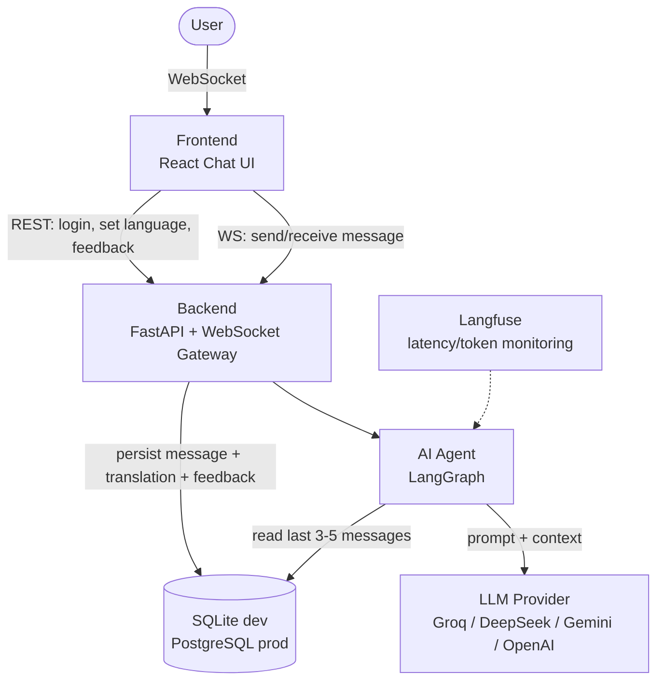
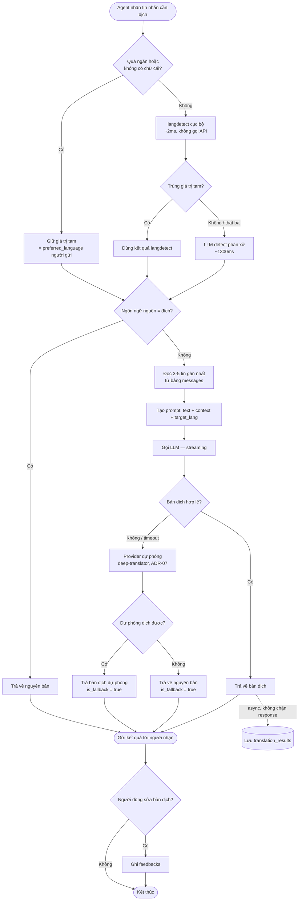
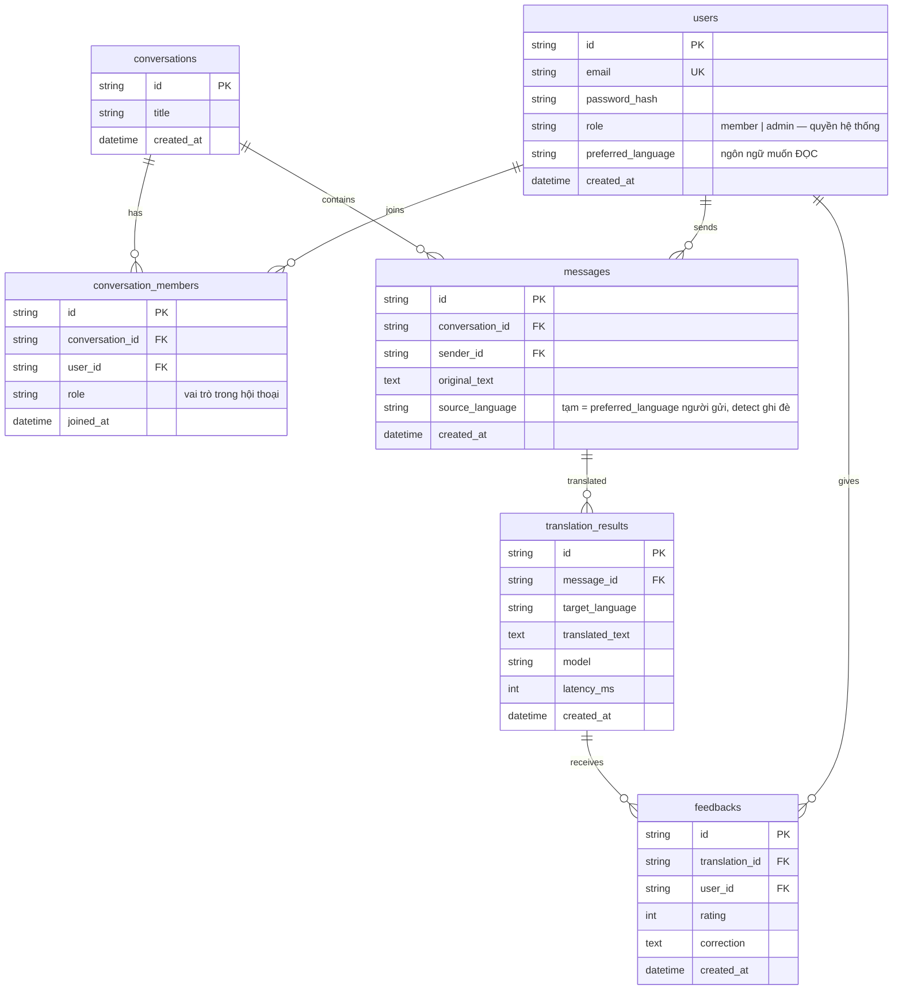
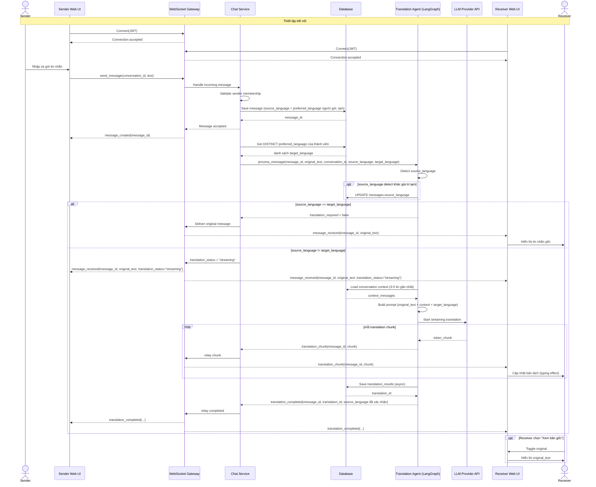
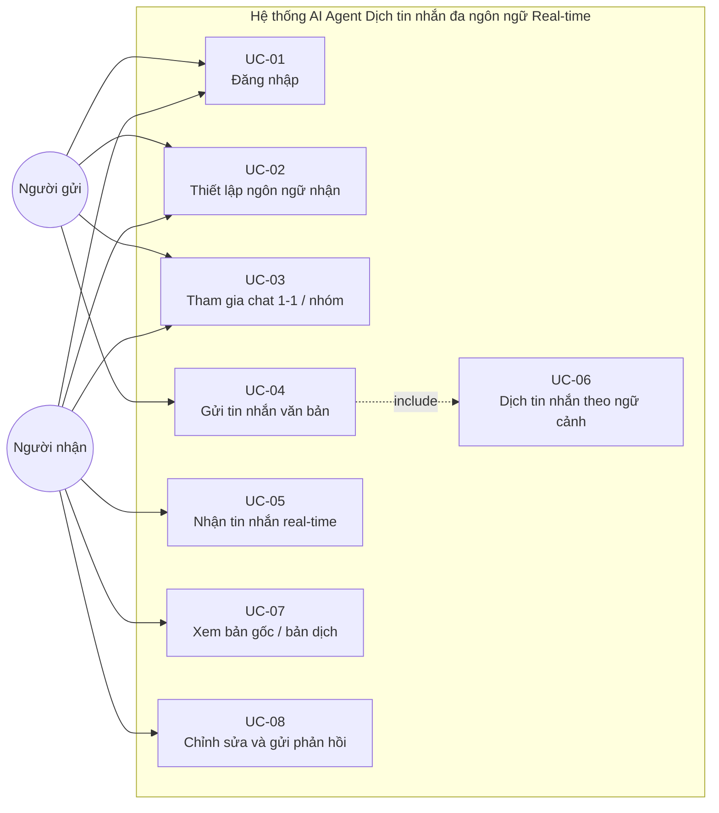

# SƠ ĐỒ KIẾN TRÚC HỆ THỐNG

**Dự án:** LinguaFlow (P-217) · **Nhóm thực hiện:** 4U
**Phiên bản:** 1.0 · **Ngày cập nhật:** 10/08/2026 · **Trạng thái:** Đang áp dụng

Tài liệu này chứa các sơ đồ kiến trúc dưới dạng Mermaid. Mô tả thành phần và căn cứ lựa chọn thiết kế: xem [`ARCHITECTURE.md`](../ARCHITECTURE.md).

| Mục | Sơ đồ | Phạm vi mô tả |
|---|---|---|
| §1 | System Overview | Thành phần hệ thống và quan hệ giữa các tầng |
| §2 | Agent Flow | Luồng xử lý bên trong AI Agent |
| §3 | Data Flow | Luồng dữ liệu giữa các tiến trình và kho dữ liệu |
| §4 | ER Diagram | Cấu trúc cơ sở dữ liệu |
| §5 | Sequence Diagram | Trình tự tương tác giữa các tầng theo thời gian |
| §6 | Use Case Diagram | Chức năng hệ thống theo góc nhìn người dùng |

---

## 1. System Overview



Hệ thống sử dụng một nguồn dữ liệu duy nhất (`DB`), đảm nhiệm đồng thời hai vai trò: lưu trữ lịch sử hội thoại dài hạn và cung cấp ngữ cảnh cho Agent. Phạm vi MVP không sử dụng Vector Store riêng (xem ADR-01 trong [`ARCHITECTURE.md`](../ARCHITECTURE.md)).

## 2. Agent Flow



**Đặc điểm kiến trúc của Agent Flow:**

1. Hệ thống không sử dụng Vector Store riêng; bước "Đọc 3-5 tin gần nhất" truy vấn trực tiếp bảng `messages`, do ngữ cảnh là cửa sổ trượt theo thời gian (ADR-01).
2. Bước xác định ngôn ngữ nguồn sử dụng chiến lược hai tầng: `langdetect` cục bộ trước, chỉ gọi LLM phân xử khi có mâu thuẫn (ADR-11).
3. Nhánh fallback xử lý theo cơ chế hai tầng: khi LLM lỗi hoặc bản dịch không hợp lệ, Agent gọi provider dự phòng `deep-translator` (ADR-07); nếu provider dự phòng cũng thất bại thì trả về nguyên bản kèm `is_fallback = true`.
4. Bước "Bản dịch hợp lệ?" bao gồm cả kiểm tra ngôn ngữ đầu ra bằng `langdetect` cục bộ, không chỉ kiểm tra độ dài (ADR-13). Ngoài ra hai bước không vẽ trong sơ đồ vì không rẽ nhánh: giới hạn kích thước `original_text` và kiểm tra dạng `target_language` chạy trước khi tạo prompt, còn từng dòng ngữ cảnh được làm sạch bên trong bước "Tạo prompt" (ADR-12). Chi tiết: `ARCHITECTURE.md` §5.2.

**Chi phí mỗi tin nhắn theo nhánh:**

| Nhánh | Số lần gọi LLM | Latency đo được (Groq) |
|---|---|---|
| Quá ngắn hoặc chỉ emoji | 0 | ~0ms |
| langdetect trùng, nguồn = đích | 0 | ~2ms |
| langdetect trùng, cần dịch | 1 | ~1501ms |
| langdetect mâu thuẫn, cần dịch | 2 | ~2800ms |
| LLM lỗi, provider dự phòng dịch thay | 1 (thất bại) | phụ thuộc mạng, giới hạn bởi `FALLBACK_TRANSLATOR_TIMEOUT_SECONDS` |

## 3. Data Flow

```mermaid
graph LR
    E1[User] -->|1. Chat message| P1((P1: Receive Message<br/>WebSocket))
    P1 -->|2. Broadcast tin gốc ngay lập tức| E1
    P1 -->|3. Message data| P2((P2: Translation Agent<br/>LangGraph))

    P2 -->|4. Query 3-5 recent messages| DB[(SQLite dev / PostgreSQL prod)]
    P2 -->|5. Translation request + prompt| E2[LLM Provider API]
    E2 -->|6. Translation stream| P2

    P2 -->|7. Translated message| E1
    P2 -.8. Async persist.-> P3((P3: Store Data<br/>Background Worker))
    P3 -->|9. Save translation_results| DB

    E1 -->|10. Submit correction| P4((P4: Handle Feedback<br/>REST API))
    P4 -->|11. Save feedbacks| DB
    P4 -.log metrics.-> Monitor[Langfuse]
```

**Ghi chú:** chỉ bước lưu bản dịch (bước 9) được thực hiện bất đồng bộ. Tin nhắn gốc được lưu đồng bộ trước khi phát tới các client, do các bước sau yêu cầu `message_id`. Trình tự chi tiết bao gồm cơ chế streaming: xem §5.

## 4. ER Diagram

> Convention theo code thật (`src/database/models.py`): tên bảng **thường, số nhiều**, PK luôn tên `id`, khóa ngoại `<entity>_id`.



**Ghi chú triển khai:**

1. Tại thời điểm cập nhật tài liệu, chỉ bảng `users` đã được hiện thực hoá (`src/database/models.py`). Các bảng còn lại khi tạo phải tuân thủ đúng tên bảng và kiểu dữ liệu quy định tại đây.
2. Hệ thống không có bảng riêng lưu ngữ cảnh. Ngữ cảnh được truy vấn trực tiếp từ bảng `messages` (xem §2).
3. Cột `confidence` đã được loại khỏi `translation_results` do không có bước nào trong Agent Flow sinh ra giá trị này. Cột sẽ được bổ sung khi hệ thống có node đánh giá độ tin cậy.
4. Hai cột `role` có ngữ nghĩa khác nhau: `users.role` là quyền ở cấp hệ thống; `conversation_members.role` là vai trò trong một cuộc hội thoại cụ thể.

## 5. Sequence Diagram

**SD-01 — Dịch tin nhắn real-time trong hội thoại 1-1**

Sơ đồ dưới đây mô tả chi tiết trình tự tương tác giữa các thành phần trong luồng dịch tin nhắn thời gian thực giữa hai người dùng khác ngôn ngữ.



**Nguyên tắc thiết kế thể hiện trong sơ đồ:**

| # | Nguyên tắc |
|---|---|
| 1 | Tin nhắn gốc được lưu và xác nhận (ACK) trước khi thực hiện dịch. Hai luồng không phụ thuộc nhau |
| 2 | Trường `source_language` tại thời điểm lưu là giá trị tạm; kết quả detect sẽ ghi đè |
| 3 | Trường hợp ngôn ngữ nguồn trùng ngôn ngữ đích, hệ thống bỏ qua bước gọi LLM |
| 4 | Sự kiện `translation_completed` bắt buộc chứa `translation_id` để Frontend thực hiện gửi phản hồi (F-05) |
| 5 | Với chat nhóm, hệ thống thực hiện một lần dịch cho mỗi ngôn ngữ đích, không phải cho mỗi người nhận |
| 6 | Mọi sự kiện từ Agent đều đi qua Chat Service. Agent độc lập với tầng truyền tải WebSocket |
| 7 | Glossary thuộc phạm vi Post-MVP, sẽ được chèn vào bước "Build prompt" khi triển khai. Không có trong luồng MVP |

## 6. Use Case Diagram



**Nguyên tắc xây dựng sơ đồ:**

1. Actor "Người gửi" chỉ liên kết với UC-04 (gửi tin nhắn). Actor "Người nhận" chỉ liên kết với UC-05, UC-07, UC-08 (nhận, xem, phản hồi). Không tồn tại liên kết chéo giữa hai vai trò.
2. UC-06 là use case được gọi qua quan hệ `<<include>>` từ UC-04, không phải use case do người dùng kích hoạt trực tiếp.
3. Sơ đồ tập trung vào các chức năng người dùng tương tác trực tiếp, không đưa các thao tác kỹ thuật nội bộ vào use case.
