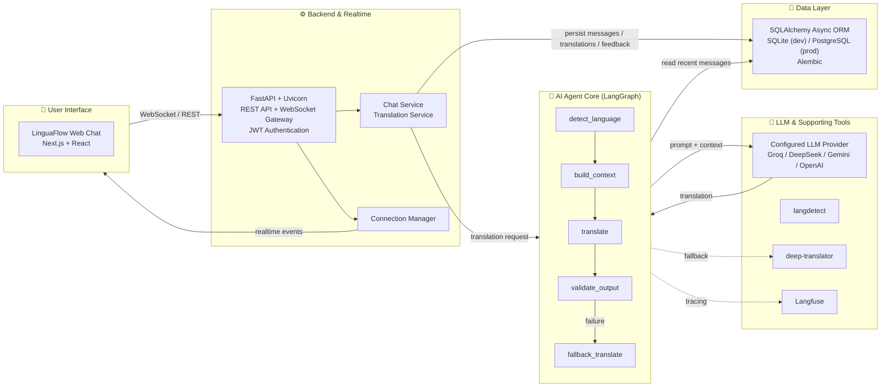

# LinguaFlow — Architecture Diagram (Gate 2)

**Dự án:** LinguaFlow (P-217) · **Mục đích:** Gate 2 Submission

## System Architecture

## Data Flow

1. User sends message from LinguaFlow web UI
2. FastAPI authenticates via JWT and persists the message
3. WebSocket delivers original message to sender immediately
4. TranslationService checks if recipient's preferred language differs from source
5. If translation needed, LangGraph Agent is invoked:
   - `detect_language`: local langdetect + LLM arbitration on conflict
   - `build_context`: reads recent messages from database
   - `translate`: calls configured LLM with prompt + context
   - `validate_output`: verifies output language
   - `fallback_translate`: uses deep-translator when LLM fails
6. Translation is persisted (async) and delivered to recipients
7. Langfuse records AI traces for observability

## Agent Nodes

| Node | Purpose |
|------|---------|
| `detect_language` | Two-tier detection: local langdetect + LLM arbitration |
| `build_context` | Reads recent messages from DB for conversation context |
| `translate` | Calls configured LLM with prompt + context |
| `validate_output` | Verifies output is in target language |
| `fallback_translate` | Uses deep-translator when LLM fails |
| `passthrough` | Returns original when source == target language |

## Supported LLM Providers

Provider-neutral adapter via LangChain with support for:
- **Groq**: `llama-3.3-70b-versatile`
- **DeepSeek**: `deepseek-chat`
- **Gemini**: `gemini-2.5-flash`
- **OpenAI**: `gpt-4o-mini`

## Deployment

| Component | Platform |
|-----------|----------|
| Frontend | Vercel |
| Backend + Agent | Railway (Docker) |
| Database | Railway PostgreSQL |
| Observability | Langfuse (optional) |

> Single backend instance required: ConnectionManager holds sockets in process memory.

## Security Notes

- JWT authentication for all API endpoints and WebSocket connections
- Backend receives plaintext messages for AI translation (server-side processing)
- No true end-to-end encryption (AI requires access to message content)
