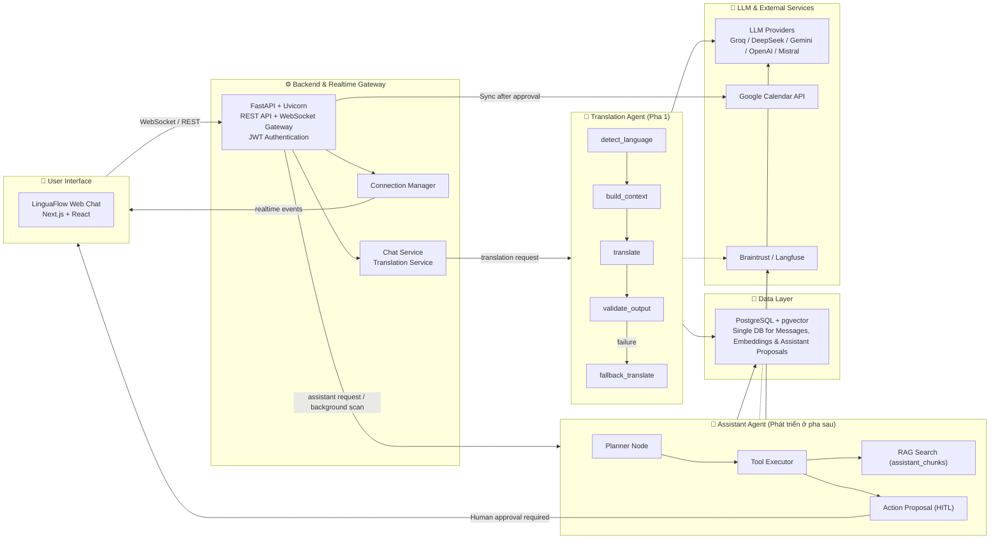

# LinguaFlow — Architecture Diagram (Gate 2 & Deliverables)

**Dự án:** LinguaFlow (P-217) · **Nhóm thực hiện:** 4U  
**Trạng thái:** Đã cập nhật đầy đủ cả **Translation Agent (Pha 1)** và **Assistant Agent (Phát triển bổ sung ở pha sau này)**.

> **Ghi chú quan trọng:** Để xem bộ 6 sơ đồ kiến trúc Mermaid hoàn chỉnh và thiết kế chi tiết nhất, vui lòng xem [`docs/architecture_diagram.md`](architecture_diagram.md) và [`ARCHITECTURE.md`](../ARCHITECTURE.md).

---

## 1. System Architecture Overview

---

## 2. Tài liệu Tham chiếu Chi tiết
- [Tài liệu Kiến trúc Cột mốc 3 & Deliverable #3 (docs/architecture.md)](architecture.md)
- [Bộ 6 Sơ đồ Kiến trúc Mermaid Chuẩn (docs/architecture_diagram.md)](architecture_diagram.md)
- [Tài liệu Thiết kế Kỹ thuật Chi tiết (ARCHITECTURE.md)](../ARCHITECTURE.md)
