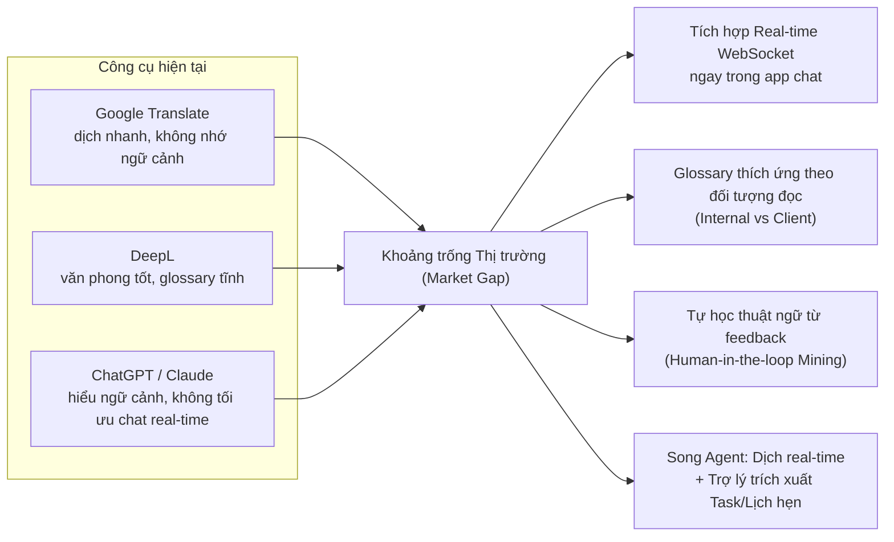
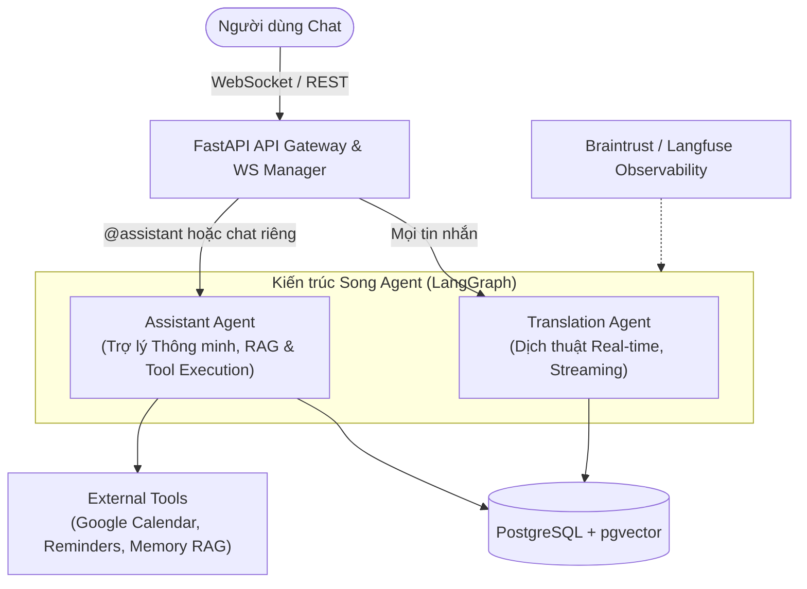
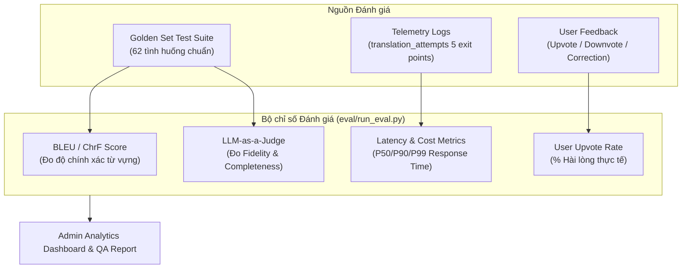

# LinguaFlow (P-217)

**Tên đề tài:** AI Agent Dịch tin nhắn đa ngôn ngữ Real-time & Trợ lý Hội thoại Thông minh  
**Nhóm thực hiện:** 4U · **Chương trình:** VinUni AI20K Build Phase  
**Phiên bản:** 3.0 — cập nhật 01/09/2026  
**Bổ sung so với 2.0:** tin nhắn thoại & phiên âm, phạm vi đọc của trợ lý, đề xuất lịch fan-out cho cả nhóm, giao diện 14 ngôn ngữ, và định hướng thương mại hoá
**Link demo**: https://c3-lingua-flow-217.dquangminh2003.id.vn/

**Đội ngũ triển khai — nhóm 4U**

| Thành viên | Vai trò chính | Vai trò phụ |
|---|---|---|
| Nguyễn Thị Trà My | Trưởng nhóm / AI | Backend |
| Nguyễn Văn Hưởng | AI | Knowledge Base |
| Nguyễn Ngọc Thuận | Frontend | Tester |
| Đinh Quang Minh | Backend | Knowledge Base |

Bốn người làm song song trong 6 tuần trên các nhánh riêng. Mỗi người giữ thêm một vai phụ ở lĩnh vực của người khác — đó là lý do `docs/CONTRACT.md` tồn tại và luôn được sửa **trước** khi viết code: bốn người cùng chạm vào một schema thì tên trường phải chốt trước, không phải hoà giải sau.

---

## Mục lục

1. [Bài toán & Khảo sát Thị trường](#1-bài-toán--khảo-sát-thị-trường)
2. [Giải pháp Kỹ thuật — Kiến trúc Agent](#2-giải-pháp-kỹ-thuật--kiến-trúc-song-agent-dual-agent-architecture)
3. [Kỹ thuật Xử lý các Case khó](#3-kỹ-thuật-xử-lý-các-case-khó-advanced-edge-case-techniques)
4. [Hệ thống Chấm điểm & Đánh giá](#4-hệ-thống-chấm-điểm--đánh-giá-evaluation-framework)
5. [Kết quả thu được](#5-kết-quả-thu-được)
6. [Hướng tới người dùng thật](#6-hướng-tới-người-dùng-thật)

---

## 1. Bài toán & Khảo sát Thị trường

### 1.1. Vấn đề thực tế (Pain Points)

Trong các phòng chat làm việc đa ngôn ngữ (Đặc biệt là phòng chat ba bên: **Quản lý dự án (PM) ↔ Lập trình viên/Designer ↔ Khách hàng quốc tế**), rào cản ngôn ngữ gây giảm hiệu suất nghiêm trọng:

| Pain Point | Tác động thực tế |
|---|---|
| **Hiểu sai ngữ cảnh & Thuật ngữ** | Các từ viết tắt kỹ thuật (`API`, `DB`, `BE`, `FE`, `PR`, `deploy`, `hotfix`) nếu dịch rời rạc theo nghĩa đen sẽ bị sai lệch specification và gây hỏng sản phẩm. |
| **Trải nghiệm dịch đứt đoạn** | Dùng Google Translate/DeepL/ChatGPT buộc người dùng phải copy-paste ra ngoài app chat, gây mất tập trung và đứt luồng thảo luận. |
| **Bỏ sót Action Items & Deadline** | Trong các luồng chat dài, các cam kết, mốc deadline và lịch hẹn dễ bị trôi mất mà không có công cụ tự động trích xuất và nhắc nhở. |
| **Rủi ro Bảo mật & Quyền riêng tư (PII)** | Khi tích hợp AI vào chat nhóm, nguy cơ lộ thông tin cá nhân (email, SĐT, số tài khoản, mật khẩu) hoặc lộ nội dung thảo luận nội bộ cho bên thứ ba. |

### 1.2. Phân tích Thị trường & Khoảng trống (Market Gap Analysis)

---

## 2. Giải pháp Kỹ thuật — Kiến trúc Agent

LinguaFlow xây dựng kiến trúc Agent chạy song song trên cùng một hạ tầng (Auth, PostgreSQL + pgvector, WebSocket Gateway, Observability Tracing):

### 2.1. Agent 1: Translation Agent (Luồng Dịch thuật Real-time)

- **Đặc điểm:** Chạy tự động cho mọi tin nhắn, độ trễ thấp (mục tiêu < 1.5s), streaming token qua WebSocket.
- **Quy trình LangGraph State Machine:**
  1. **Local Detect:** Kiểm tra ngôn ngữ cục bộ (`langdetect`) ~2ms.
  2. **LLM Arbitration:** Chỉ gọi LLM phân xử khi mâu thuẫn giữa khai báo và detect.
  3. **Context Injection:** Đọc 3-5 tin nhắn gần nhất để giữ đúng mạch hội thoại.
  4. **Audience-Aware Customization:** Tra cứu Glossary theo vị thế xưng hô và đối tượng đọc (`internal` vs `client`).
  5. **2-Level Fallback:** Nếu LLM lỗi/timeout ➔ Chuyển qua `deep-translator` ➔ Nếu vẫn lỗi ➔ Trả về bản gốc an toàn với flag `is_fallback = true`.

### 2.2. Agent 2: Assistant Agent (Trợ lý Thông minh & Quản lý Tác vụ)

- **Đặc điểm:** Kích hoạt theo yêu cầu (Chat riêng với Assistant hoặc gõ `@assistant` trong chat nhóm). Trả lời riêng tư (`visibility = 'private'`).
- **Quy trình xử lý Autonomous Planner:**
  1. **Consent Verification (ADR-30):** Kiểm tra quyền đọc hội thoại của người dùng trước khi nạp tin nhắn.
  2. **RAG Memory Retrieval:** Tìm kiếm tri thức và lịch sử hội thoại liên quan qua `pgvector`.
  3. **Task & Reminder Extraction:** Trích xuất hành động, thời hạn, người phụ trách từ nội dung chat.
  4. **Human-in-the-Loop Confirmation:** Hiển thị popup xác nhận trước khi ghi dữ liệu hoặc đồng bộ Google Calendar.

- **Phạm vi đọc do nơi hỏi quyết định, không do câu hỏi:**

| Hỏi ở đâu | Trợ lý đọc được gì |
|:---|:---|
| Chat riêng với trợ lý | **Mọi hội thoại** tài khoản là thành viên, kèm danh sách thành viên từng nhóm |
| `@assistant` trong một hội thoại | **Đúng hội thoại đó**, không gì khác |

---

## 3. Kỹ thuật Xử lý các Case khó

Trong quá trình phát triển, nhóm đã áp dụng các kỹ thuật chuyên sâu để giải quyết 5 nhóm bài toán khó (Edge Cases):

### Case 1: Tối ưu Độ trễ (Latency) & Chi phí gọi LLM
- **Bài toán:** Gọi LLM cho mọi tin nhắn gây tăng latency (2.6s/tin) và tốn kém token.
- **Kỹ thuật xử lý:** **Tách lọc ngôn ngữ 2 tầng (2-tier Language Detection)**.
  - Tầng 1: Chạy `langdetect` cục bộ (~2ms, 0đ chi phí). Nguồn và đích trùng nhau ➔ Trả về ngay không gọi LLM.
  - Tầng 2: Chỉ khi `langdetect` mâu thuẫn với thông tin người gửi mới gọi LLM phân xử.
- **Kết quả:** Giảm latency từ **2610ms xuống 1501ms** (~42.5%), tiết kiệm hơn 35% chi phí API.

### Case 2: Xử lý Ngữ cảnh & Thuật ngữ theo Đối tượng đọc (Audience Awareness)
- **Bài toán:** Từ "deploy" gửi cho Dev nội bộ nên giữ nguyên `deploy`, nhưng gửi cho Khách hàng nên dịch thành `triển khai`.
- **Kỹ thuật xử lý:** **Honorific & Audience Profile Fan-out**.
  - Hệ thống lưu trữ `honorific_profile` (`senior`, `peer`, `junior`, `client`).
  - Node `customize` trong LangGraph tra cứu bảng `glossary_entries` dựa theo cặp `(source_lang, target_lang, audience)`.

### Case 3: Lọc Nhiễu & Tự động Đề xuất Glossary từ Chỉnh sửa Người dùng
- **Bài toán:** Người dùng sửa bản dịch nhưng có thể sửa sai, sửa ngẫu nhiên hoặc gõ nhầm.
- **Kỹ thuật xử lý:** **Semantic Embedding Clustering & Multi-user Verification**.
  - Lưu các chỉnh sửa vào `correction_log` (khi người dùng bật consent).
  - Thuật toán Offline Mining thực hiện gom cụm Vector Embeddings với độ tương đồng Cosine $\ge 0.85$.
  - **Điều kiện lọc khắt khe:** Chỉ tạo `GlossaryProposal` khi thỏa mãn đồng thời: `occurrence_count >= 3` VÀ `distinct_user_count >= 2` (phải có ít nhất 2 người khác nhau cùng sửa giống nhau).
  - Admin duyệt trên Bảng điều khiển (`/admin` GlossaryPanel) trước khi thành `GlossaryEntry` chính thức.

### Case 4: An toàn Quyền riêng tư & Bảo vệ PII (Guardrails & Privacy)
- **Bài toán:** Tin nhắn chứa thông tin nhạy cảm (mật khẩu, STK, email) hoặc dữ liệu riêng tư trong hội thoại nhóm.
- **Kỹ thuật xử lý:**
  - **Assistant Consent Scope:** Bắt buộc người dùng cấp quyền đọc hội thoại mới cho phép Assistant truy cập RAG context.
  - **Privacy-Preserving Telemetry:** Mọi log tracing (Braintrust/Langfuse) và log lỗi hệ thống đều được làm sạch, mask PII, chỉ ghi nhận metadata (token count, latency, error code) không lưu trữ văn bản thô của người dùng.

### Case 5: Đảm bảo Hệ thống Không Bao giờ Cắt đứt Hội thoại (Zero-Crash Resilience)
- **Bài toán:** LLM Provider (Groq/DeepSeek) bị rate-limit, timeout hoặc ngắt kết nối.
- **Kỹ thuật xử lý:** **2-Level Graceful Fallback Architecture**.
  - Tầng 1: Tự động chuyển hướng sang Provider dự phòng (`deep-translator`).
  - Tầng 2: Nếu cả tầng dự phòng thất bại ➔ Trả về nguyên bản tin nhắn ban đầu kèm flag `is_fallback = true` và ghi log telemetry tại điểm thoát. Chat vẫy chạy liên tục, không bao giờ vỡ UI.

---

## 4. Hệ thống Chấm điểm & Đánh giá (Evaluation Framework)

Dự án LinguaFlow áp dụng hệ thống đánh giá đa chiều kết hợp giữa **Tự động hóa (Automated Benchmarking)**, **LLM-as-a-Judge** và **Phản hồi Người dùng thật (Human Feedback)**:

### 4.1. Bộ Đánh giá Golden Set (`eval/golden_set.jsonl`)
- Gồm **62+ kịch bản kiểm thử có nhãn**, bao gồm:
  - Dịch thuật ngữ IT / Software Outsourcing.
  - Dịch câu ngắn, từ lóng, viết tắt (`FE`, `BE`, `PR`, `LGTM`).
  - Khả năng xử lý xưng hô theo vị thế (`senior`, `client`).
  - Xử lý tin nhắn chứa ký tự đặc biệt, đoạn code.

### 4.2. Bộ Chỉ số Đánh giá (Evaluation Metrics)

1. **Điểm BLEU / ChrF:** So sánh bản dịch đầu ra với bản dịch chuẩn (Reference Translation).
2. **Điểm Fidelity & Completeness (LLM-as-a-Judge):** Đánh giá xem bản dịch có giữ nguyên ý nghĩa cốt lõi và không bỏ sót các thông tin kỹ thuật quan trọng hay không (thang điểm 1 - 5).
3. **Chỉ số Telemetry (5 Exit Points Tracking):** Theo dõi tỷ lệ thành công của LLM chính, tỷ lệ chuyển qua Fallback, và tỷ lệ trả về tin nhắn gốc.
4. **User Upvote/Downvote Ratio:** Thống kê từ `POST /api/v1/translations/{id}/feedback` và `GET /api/v1/admin/feedback` để đo tỷ lệ hài lòng thực tế của người dùng.

---

## 5. Kết quả thu được

### 5.1. Ma trận tính năng đã nghiệm thu

| Mã | Tính năng | Trạng thái | Nơi kiểm chứng |
|:---:|:---|:---:|:---|
| **F-01** | Xác thực JWT, OTP đăng ký, đặt ngôn ngữ dịch & ngôn ngữ giao diện | ✓ | `src/api/routes.py`, `tests/test_api/test_auth.py` (23 test) |
| **F-02** | Chat real-time 1-1 và nhóm qua WebSocket | ✓ | `src/api/websocket.py`, `src/services/connection_manager.py` |
| **F-03** | Dịch có ngữ cảnh, phát hiện ngôn ngữ hai tầng, fallback 2 mức | ✓ | `src/agents/graph.py`, `src/agents/nodes/translation.py` |
| **F-04** | Bật/tắt bản gốc — bản dịch trên từng tin nhắn | ✓ | `frontend/src/features/chat/components/MessageBubble.tsx` |
| **F-05** | Human-in-the-loop: upvote/downvote và sửa bản dịch | ✓ | `src/services/correction_log.py` |
| **F-06** | Guardrail đầu vào/đầu ra, giới hạn độ dài, chống giả mạo thẻ ngữ cảnh | ✓ | `src/agents/guardrails.py`, `docs/GUARDRAILS.md` |
| **F-07** | Khai phá thuật ngữ tự động + bảng duyệt của quản trị | ✓ | `src/services/glossary_mining.py` |
| **F-08** | Assistant Agent: RAG riêng, trích việc, lịch cá nhân, đồng bộ Google Calendar | ✓ | `src/agents/assistant/`, `src/services/calendar.py` |
| **F-09** | Tin nhắn thoại: ghi âm → phiên âm (Gemini STT) → dịch → trích việc | ✓ | `src/services/voice_transcription.py`, `src/services/audio_conversion.py` |
| **F-10** | Gọi thoại/video 1-1 qua WebRTC | ✓ | `src/services/rtc.py` |
| **F-11** | Giao diện 14 ngôn ngữ theo cài đặt tài khoản | ✓ | `frontend/src/features/chat/i18n.ts` (576 khóa), `scripts/check_ui_keys.py` |

### 5.2. Kiểm thử tự động

| Bộ | Số lượng | Kết quả |
|:---|:---:|:---|
| Backend (`pytest tests/`) | **1236** | toàn bộ đạt, ~22 phút |
| Frontend (`vitest`) | **53** | toàn bộ đạt |
| Kiểu tĩnh (`tsc --noEmit`) | — | 0 lỗi |
| Lint (`ruff`, `eslint`) | — | 0 lỗi |
| Migration | 38 revision | một `head` duy nhất |

### 5.3. Kết quả đánh giá chất lượng dịch — kể cả phần chưa đạt

Chạy trên `eval/golden_set.jsonl` (62 mẫu), chấm bằng LLM-as-judge (`mistral-medium` chấm `gemini-3.7-flash`):

| Chỉ số | Mục tiêu | Thực tế | |
|:---|:---:|:---:|:---|
| Tỷ lệ đạt (≥ 0.7) | > 80% | **100%** | đạt |
| Điểm trung bình | > 0.80 | **0.912** | đạt |
| chrF++ / BLEU / TER | — | 65.6 / 52.2 / 56.9 | đạt |
| Tuân thủ glossary | 100% | **100%** | đạt |
| Số lần fallback | 0 | **0** | đạt |
| **Độ trễ trung bình** | < 2000ms | **2324ms** | **chưa đạt** |
| **Độ trễ p95** | < 5000ms | **4608ms** | **đạt** |
| **Đúng ngôn ngữ đích** | 100% | **96,6%** | **chưa đạt** |

### 5.4. Phân tích tính khả thi

Mục này đánh giá khả năng tồn tại của sản phẩm trên bốn trục: khác biệt chức năng so với giải pháp sẵn có, cơ sở kỹ thuật của khác biệt đó, khả năng duy trì, và tính khả thi kinh tế. Mỗi số liệu được dẫn nguồn tại chỗ.

#### 5.4.1. Khác biệt chức năng so với giải pháp sẵn có

Các giải pháp hiện có xử lý ở **mức câu**: nhận một đoạn văn bản, trả về bản dịch, kết thúc. Phạm vi xử lý của LinguaFlow mở rộng thêm một bước — từ nội dung hội thoại tới **hành động được ghi nhận**.

| Bước xử lý | Google Translate / DeepL | Zoom AI Companion / Teams | LinguaFlow |
|---|:---:|:---:|:---:|
| Dịch một câu | có | có | có |
| Giữ ngữ cảnh 3–5 lượt trước | không | trong phiên họp | có |
| Bề mặt hoạt động | ứng dụng rời | phòng họp, kết thúc khi họp tan | luồng chat, liên tục |
| Trích cam kết thành mục lịch | không | không | có |
| Cá thể hoá theo từng người nhận | không | không | một hàng đề xuất / thành viên |
| Bước xác nhận của người dùng | không áp dụng | không áp dụng | bắt buộc trước khi ghi |

Khác biệt trọng yếu nằm ở ba dòng cuối. Trong quy trình outsourcing và xuất nhập khẩu, cam kết công việc (*"gửi báo giá trước thứ Sáu"*) phát sinh chủ yếu trong chat giữa các cuộc họp, không phải trong cuộc họp. Giải pháp gắn với phòng họp không quan sát được bề mặt này.

#### 5.4.2. Cơ sở kỹ thuật của khác biệt

Chất lượng dịch ở mức câu của DeepL và các mô hình ngôn ngữ lớn là tốt; dự án không có số liệu nào chứng minh điều ngược lại, do bộ đánh giá tại §5.3 chấm trên golden set nội bộ và không so sánh chéo với sản phẩm khác. Khác biệt chức năng vì vậy **không dựa trên giả định chất lượng dịch cao hơn**, mà dựa trên ba đặc điểm ngôn ngữ khiến đơn vị "một câu" không đủ:

| Hiện tượng ngôn ngữ | Hệ quả khi dịch rời từng câu | Cơ chế xử lý trong hệ thống |
|---|---|---|
| Tiếng Việt lược chủ ngữ, không đánh dấu thì | *"Gửi rồi nhé"* mất chủ thể, thời điểm và tân ngữ; bộ dịch buộc phải suy đoán | Nạp 3–5 lượt gần nhất vào ngữ cảnh trước khi dịch (`build_context`) |
| Đại từ xưng hô mã hoá vai vế; tiếng Anh quy về "you" | Dịch chiều ngược lại chọn xưng hô ngẫu nhiên, sai vai vế trong hội thoại với khách hàng | Suy luận hồ sơ hội thoại, giữ trục xưng hô nhất quán (`profile_inference`) |
| Một thuật ngữ cần hai cách diễn đạt tuỳ người đọc | Glossary tĩnh chỉ có một ánh xạ cho mỗi thuật ngữ | Glossary tra theo đối tượng đọc (nội bộ / khách hàng), bổ sung tự động từ log chỉnh sửa của người dùng |

#### 5.4.3. Khả năng duy trì khác biệt

Về mặt kỹ thuật, các nền tảng lớn **có đủ năng lực triển khai** chức năng tương đương. Khác biệt hiện tại đến từ việc chưa nền tảng nào triển khai, không đến từ rào cản kỹ thuật. Ba yếu tố làm chậm quá trình thu hẹp khoảng cách:

1. **Khác bề mặt vận hành.** Trợ lý gắn với phòng họp chỉ hoạt động trong thời gian họp. Việc mở rộng sang luồng chat liên tục là thay đổi phạm vi sản phẩm, không phải bổ sung tính năng.
2. **Khác ràng buộc thiết kế.** Tính năng miễn phí đi kèm tối ưu cho độ phủ. Bài toán ở đây có ràng buộc trách nhiệm — hệ thống từ chối đặt lịch khi chưa có múi giờ đáng tin thay vì đặt sai giờ, và không ghi bất kỳ mục lịch nào trước bước xác nhận của người dùng (ADR-30, ADR-34). Ràng buộc này làm giảm tỷ lệ tự động hoá nhưng là điều kiện để bán theo kết quả.
3. **Dữ liệu tích luỹ không sao chép được.** Glossary theo đối tượng đọc được bồi đắp từ chính log chỉnh sửa của doanh nghiệp sử dụng. Chức năng có thể sao chép; dữ liệu vận hành của một khách hàng cụ thể thì không.

#### 5.4.4. Tính khả thi kinh tế

Số liệu lấy từ mô hình chi phí Track 1 — Day 25, đối chiếu giá API tại thời điểm 27/08/2026.

| Chỉ tiêu | Giá trị | Nguồn |
|---|---:|---|
| Giá bán đề xuất | $1,50 / cuộc họp hoàn tất | mô hình định giá theo kết quả |
| Chi phí biến đổi thực tế | $0,4102 / cuộc họp hoàn tất | bóc tách LLM + STT + hạ tầng + retry + HITL |
| Biên lợi nhuận gộp | 72,65% | suy ra từ hai dòng trên |
| Ngưỡng hoà vốn (biên 60%) | tỷ lệ tự xử lý ≥ 71,63% | giải phương trình breakeven |
| Tỷ lệ tự xử lý đo được | 82,0% | bộ đánh giá Day 21–22 |

Biên độ an toàn hiện tại là 10,37 điểm phần trăm trên ngưỡng hoà vốn. Mức giá này nằm trong khả năng chi trả của phân khúc doanh nghiệp 20–200 nhân sự, không phụ thuộc vào định giá enterprise.

#### 5.4.5. Rủi ro đã nhận diện

| Rủi ro | Mức độ | Trạng thái hiện tại |
|---|:---:|---|
| Tỷ lệ đúng ngôn ngữ đích 96,6% (§5.3) — sai khoảng 1/30 tin nhắn, ảnh hưởng trực tiếp cam kết cốt lõi | Cao | Nút `validate_output` đã phát hiện và ghi nhận `wrong_language`; chưa chốt hành vi khi phát hiện — thử lại hay trả nguyên văn |
| Hệ thống chỉ chạy được một bản sao (ADR-18) — vừa là trần công suất, vừa là điểm chết đơn lẻ | Cao | Cần backplane dùng chung trước khi mở rộng |
| Tỷ lệ tự xử lý 82% đo trên bộ eval, chưa đo trên người dùng thật | Trung bình | Là chỉ số phải đo lại đầu tiên khi có lưu lượng thật |
| Nền tảng lớn bổ sung chức năng trích cam kết theo từng người | Trung bình | Phụ thuộc dữ liệu tích luỹ (5.4.3) để giữ khác biệt |
| Luồng phát hiện cam kết timeout ở 10 giây, thất bại không phát tín hiệu | Trung bình | Quan sát được khi chạy thử 01/09; chưa có retry hoặc chỉ báo |

### 5.5. Phiên bản triển khai

| Thành phần | Nơi chạy |
|:---|:---|
| Backend + Agent | Ubuntu VPS, container GHCR dựng sẵn, **đúng một bản sao** |
| Cơ sở dữ liệu | `pgvector/pgvector:pg16` trên cùng VPS, volume bền vững |
| Frontend | Ubuntu VPS, container GHCR sau Caddy |
| Quan sát | Braintrust (mặc định) hoặc Langfuse, đổi bằng biến môi trường |

---

## 6. Định hướng tương lai tới người dùng thật

### 6.1. Định vị: bán kết quả, không bán phần mềm

| | Khung A — Phần mềm | **Khung B — Thay thế công việc (đã chọn)** |
|:---|:---|:---|
| Cách nói | "Phần mềm trợ lý AI dịch họp và ghi biên bản" | "Đảm bảo 100% cuộc họp đa quốc gia được dịch chuẩn, biên bản & task giao đúng hạn" |
| Người quyết chi | IT Director | **COO / Head of Operations** |
| Lấy từ ngân sách | SaaS | **Nhân sự / Vận hành** |
| Bị so với | Zoom AI Companion ($0), Teams Premium ($10/user) | Thuê phiên dịch part-time ($600–1.000/tháng) |
| Phản đối lớn nhất | "Đã có Zoom/Teams miễn phí rồi" | "AI dịch sai gây thiệt hại hợp đồng thì ai chịu?" |

Lý do chọn B: ngân sách vận hành lớn và linh hoạt hơn ngân sách SaaS, vốn bị đọ giá trực tiếp với một sản phẩm giá $0 tích hợp sẵn.

### 6.2. Đơn vị tính tiền: một "Completed Job"

Mô hình đề xuất là **Outcome-based** (Attribution 8/10 × Autonomy cao), giá $1,50/completed meeting, với ngưỡng hòa vốn:

| Containment | Cost/Completed Job | Gross Margin | |
|:---:|:---:|:---:|:---|
| 60,0% | $0,6240 | 58,4% | cảnh báo |
| **71,63%** | $0,6000 | **60,0%** | ngưỡng hòa vốn |
| **82,0%** (đo thực) | **$0,4102** | **72,65%** | an toàn |

**con số 82% đó đến từ eval, chưa phải từ người dùng thật.** Việc đầu tiên khi có người dùng là đo lại containment thật và đối chiếu với ngưỡng 71,63% — dưới ngưỡng đó thì mô hình giá không còn lãi lành mạnh.

### 6.3. Kênh 90 ngày đầu: Partner-Led

Kênh chốt là **Partner-Led** qua liên minh tư vấn chuyển đổi số & IT Outsourcing (FPT Digital, Rikkei Soft, VNITO Alliance), chia sẻ 25% doanh thu. Bề mặt tích hợp mục tiêu: **Google Meet Chrome Extension** và **Zoom App Bot**, xuất biên bản & action item thẳng vào Slack/Notion của doanh nghiệp.

Khoảng cách kỹ thuật giữa bản hiện tại và bề mặt đó là rõ ràng: LinguaFlow hôm nay là một ứng dụng chat độc lập; để vào được cuộc họp Meet/Zoom cần một lớp bot tham gia phòng họp và nhận luồng audio — hạ tầng phiên âm và trích việc thì đã sẵn sàng, phần thiếu là đường vào.

### 6.4. Nâng cấp hệ thống hiện có

- **Đồng bộ hai chiều Google Calendar** đã có một chiều (đẩy lên) và pull định kỳ 300s; cần webhook để sự kiện đổi bên Google phản ánh ngược lại tức thì.
- **Ranh giới dữ liệu Admin/User**: quản trị xem chi phí, token, duyệt thuật ngữ — **không bao giờ đọc nội dung chat thô**. `message_visibility.public_only()` đã là nền cho việc này.
- **Bảng điều khiển chất lượng**: trực quan hóa xu hướng chrF++/BLEU, tỷ lệ upvote, chi phí token theo ngày và theo model, hiệu suất đề xuất glossary.
- **Mở rộng grammar thời gian**: hiện đã hiểu "ngày kia", "thứ 6 tuần sau", "6 giờ rưỡi", "3pm"; chưa hiểu mốc chỉ có giờ mà không có ngày, và chưa hiểu tiếng Việt không dấu.
