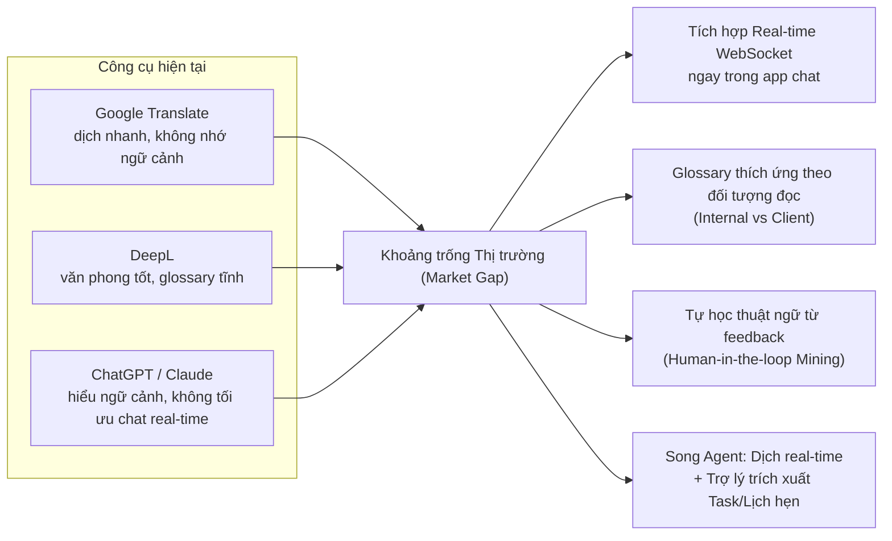
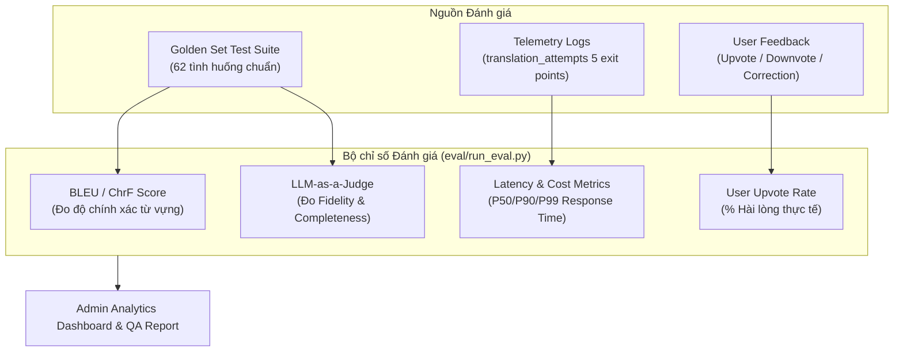
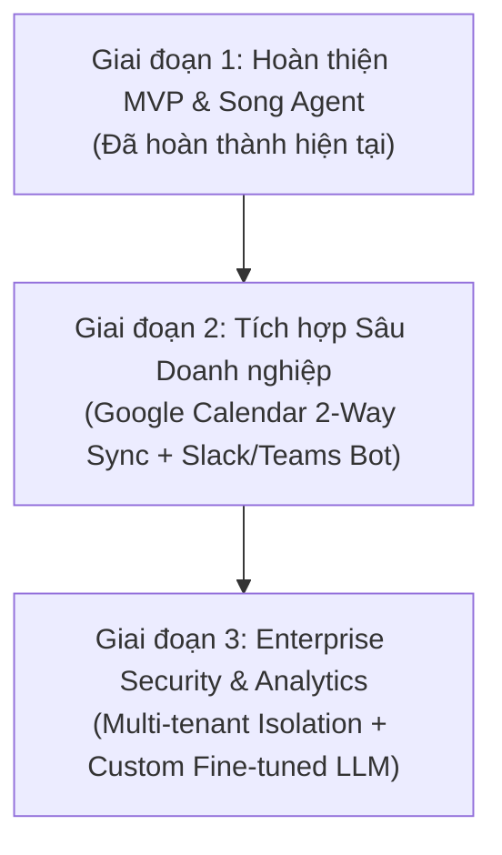

# LinguaFlow (P-217) — Trình bày Dự án & Pitch Deck Cập nhật

**Tên đề tài:** AI Agent Dịch tin nhắn đa ngôn ngữ Real-time & Trợ lý Hội thoại Thông minh  
**Nhóm thực hiện:** 4U · **Chương trình:** VinUni AI20K Build Phase  
**Phiên bản cập nhật:** 2.0 (Đã bổ sung Phân hệ **Assistant Agent**, Đánh giá **Golden Set**, **Glossary Mining** & **Kết quả Nghiệm thu**)

---

## 📋 Mục lục

1. [Bài toán & Khảo sát Thị trường](#1-bài-toán--khảo-sát-thị-trường)
2. [Giải pháp Kỹ thuật — Kiến trúc Song Agent (Dual-Agent Architecture)](#2-giải-pháp-kỹ-thuật--kiến-trúc-song-agent-dual-agent-architecture)
3. [Kỹ thuật Xử lý các Case Khó (Advanced Edge Case Techniques)](#3-kỹ-thuật-xử-lý-các-case-khó-advanced-edge-case-techniques)
4. [Hệ thống Chấm điểm & Đánh giá (Evaluation Framework)](#4-hệ-thống-chấm-điểm--đánh-giá-evaluation-framework)
5. [Kết quả Nghiệm thu Sản phẩm (Product Acceptance Results)](#5-kết-quả-nghiệm-thu-sản-phẩm-product-acceptance-results)
6. [Hướng Phát triển & Lộ trình Doanh nghiệp (Future Roadmap)](#6-hướng-phát-triển--lộ-trình-doanh-nghiệp-future-roadmap)

---

## 1. Bài toán & Khảo sát Thị trường

### 1.1. Vấn đề thực tế (Pain Points)

Trong các phòng chat làm việc đa ngôn ngữ (Đặc biệt là phòng chat ba bên: **Quản lý dự án (PM) ↔ Lập trình viên/Designer ↔ Khách hàng quốc tế**), rào cản ngôn ngữ gây giảm hiệu suất nghiêm trọng:

| Pain Point | Tác động thực tế |
|---|---|
| **Hiểu sai ngữ cảnh & Thuật ngữ** | Các từ viết tắt kỹ thuật (`API`, `DB`, `BE`, `FE`, `PR`, `deploy`, `hotfix`) nếu dịch rời rạc theo nghĩa đen sẽ bị sai lệch specification và gây hỏng sản phẩm. |
| **Trải nghiệm dịch đứt đoạn** | Dùng Google Translate/DeepL/ChatGPT buộc người dùng phải copy-paste ra ngoài app chat, gây mất tập trung và đứt luồng thảo luận. |
| **Bỏ sót Action Items & Deadline** | Trong các luồng chat dài, các cam kết, mốc deadline và lịch hẹn dễ bị trôi mất mà không có công cụ tự động trích xuất và nhắc nhở. |
| **Rủi ro Bảo mật & Quyền riêng tư (PII)** | Khi tích hợp AI vào chat nhóm, nguy cơ lộ thông tin cá nhân (email, SĐT, số tài khoản, mật khẩu) hoặc lộ nội dung thảo luận nội bộ cho bên thứ ba. |

### 1.2. Phân tích Thị trường & Khoảng trống (Market Gap Analysis)

#### Bảng so sánh tính năng đối thủ & LinguaFlow:

| Tiêu chí | Google Translate | DeepL | ChatGPT / Claude | LinguaFlow (P-217) |
|---|:---:|:---:|:---:|:---:|
| **Dịch Real-time WebSocket** | ✗ | ✗ | ✗ | **✓ (Streaming < 1.5s)** |
| **Nhớ ngữ cảnh 3-5 tin gần nhất** | ✗ | ✗ | ✓ | **✓ (Context Injection)** |
| **Glossary theo đối tượng đọc** | ✗ | △ (Tĩnh) | ✗ | **✓ (Internal vs Client)** |
| **Tự khai phá thuật ngữ (Mining)** | ✗ | ✗ | ✗ | **✓ (Cosine Clustering + Admin Approval)** |
| **Trợ lý trích xuất Task & Lịch** | ✗ | ✗ | △ (Hỏi riêng) | **✓ (Assistant Agent + Google Calendar)** |
| **Bảo mật RAG & Consent Scope** | ✗ | ✗ | ✗ | **✓ (ADR-30 & ADR-16)** |

*(✓ = Tốt · △ = Hạn chế · ✗ = Chưa hỗ trợ)*

---

## 2. Giải pháp Kỹ thuật — Kiến trúc Song Agent (Dual-Agent Architecture)

LinguaFlow xây dựng kiến trúc **Song Agent chạy song song** trên cùng một hạ tầng (Auth, PostgreSQL + pgvector, WebSocket Gateway, Observability Tracing):

### 2.1. Agent 1: Translation Agent (Luồng Dịch thuật Real-time)

- **Đặc điểm:** Chạy tự động cho mọi tin nhắn, độ trễ thấp (mục tiêu < 1.5s), streaming token qua WebSocket.
- **Quy trình LangGraph State Machine:**
  1. **Local Detect:** Kiểm tra ngôn ngữ cục bộ (`langdetect`) ~2ms.
  2. **LLM Arbitration:** Chỉ gọi LLM phân xử khi mâu thuẫn giữa khai báo và detect.
  3. **Context Injection:** Đọc 3-5 tin nhắn gần nhất để giữ đúng mạch hội thoại.
  4. **Audience-Aware Customization:** Tra cứu Glossary theo vị thế xưng hô và đối tượng đọc (`internal` vs `client`).
  5. **2-Level Fallback:** Nếu LLM lỗi/timeout ➔ Chuyển qua `deep-translator` ➔ Nếu vẫn lỗi ➔ Trả về bản gốc an toàn với flag `is_fallback = true`.

### 2.2. Agent 2: Assistant Agent (Trợ lý Thông minh & Quản lý Tác vụ)

- **Đặc điểm:** Kích hoạt theo yêu cầu (Chat riêng với Assistant hoặc gõ `@assistant` trong chat nhóm). Trả lời riêng tư (`visibility = 'private'`).
- **Quy trình xử lý Autonomous Planner:**
  1. **Consent Verification (ADR-30):** Kiểm tra quyền đọc hội thoại của người dùng trước khi nạp tin nhắn.
  2. **RAG Memory Retrieval:** Tìm kiếm tri thức và lịch sử hội thoại liên quan qua `pgvector`.
  3. **Task & Reminder Extraction:** Trích xuất hành động, thời hạn, người phụ trách từ nội dung chat.
  4. **Human-in-the-Loop Confirmation:** Hiển thị popup xác nhận trước khi ghi dữ liệu hoặc đồng bộ Google Calendar.

---

## 3. Kỹ thuật Xử lý các Case Khó (Advanced Edge Case Techniques)

Trong quá trình phát triển, nhóm đã áp dụng các kỹ thuật chuyên sâu để giải quyết 5 nhóm bài toán khó (Edge Cases):

### 🛠️ Case 1: Tối ưu Độ trễ (Latency) & Chi phí gọi LLM
- **Bài toán:** Gọi LLM cho mọi tin nhắn gây tăng latency (2.6s/tin) và tốn kém token.
- **Kỹ thuật xử lý:** **Tách lọc ngôn ngữ 2 tầng (2-tier Language Detection)**.
  - Tầng 1: Chạy `langdetect` cục bộ (~2ms, 0đ chi phí). Nguồn và đích trùng nhau ➔ Trả về ngay không gọi LLM.
  - Tầng 2: Chỉ khi `langdetect` mâu thuẫn với thông tin người gửi mới gọi LLM phân xử.
- **Kết quả:** Giảm latency từ **2610ms xuống 1501ms** (~42.5%), tiết kiệm hơn 35% chi phí API.

### 🛠️ Case 2: Xử lý Ngữ cảnh & Thuật ngữ theo Đối tượng đọc (Audience Awareness)
- **Bài toán:** Từ "deploy" gửi cho Dev nội bộ nên giữ nguyên `deploy`, nhưng gửi cho Khách hàng nên dịch thành `triển khai`.
- **Kỹ thuật xử lý:** **Honorific & Audience Profile Fan-out**.
  - Hệ thống lưu trữ `honorific_profile` (`senior`, `peer`, `junior`, `client`).
  - Node `customize` trong LangGraph tra cứu bảng `glossary_entries` dựa theo cặp `(source_lang, target_lang, audience)`.

### 🛠️ Case 3: Lọc Nhiễu & Tự động Đề xuất Glossary từ Chỉnh sửa Người dùng
- **Bài toán:** Người dùng sửa bản dịch nhưng có thể sửa sai, sửa ngẫu nhiên hoặc gõ nhầm.
- **Kỹ thuật xử lý:** **Semantic Embedding Clustering & Multi-user Verification**.
  - Lưu các chỉnh sửa vào `correction_log` (khi người dùng bật consent).
  - Thuật toán Offline Mining thực hiện gom cụm Vector Embeddings với độ tương đồng Cosine $\ge 0.85$.
  - **Điều kiện lọc khắt khe:** Chỉ tạo `GlossaryProposal` khi thỏa mãn đồng thời: `occurrence_count >= 3` VÀ `distinct_user_count >= 2` (phải có ít nhất 2 người khác nhau cùng sửa giống nhau).
  - Admin duyệt trên Bảng điều khiển (`/admin` GlossaryPanel) trước khi thành `GlossaryEntry` chính thức.

### 🛠️ Case 4: An toàn Quyền riêng tư & Bảo vệ PII (Guardrails & Privacy)
- **Bài toán:** Tin nhắn chứa thông tin nhạy cảm (mật khẩu, STK, email) hoặc dữ liệu riêng tư trong hội thoại nhóm.
- **Kỹ thuật xử lý:**
  - **Assistant Consent Scope (ADR-30):** Bắt buộc người dùng cấp quyền đọc hội thoại mới cho phép Assistant truy cập RAG context.
  - **Privacy-Preserving Telemetry (ADR-16):** Mọi log tracing (Braintrust/Langfuse) và log lỗi hệ thống đều được làm sạch, mask PII, chỉ ghi nhận metadata (token count, latency, error code) không lưu trữ văn bản thô của người dùng.

### 🛠️ Case 5: Đảm bảo Hệ thống Không Bao giờ Cắt đứt Hội thoại (Zero-Crash Resilience)
- **Bài toán:** LLM Provider (Groq/DeepSeek) bị rate-limit, timeout hoặc ngắt kết nối.
- **Kỹ thuật xử lý:** **2-Level Graceful Fallback Architecture**.
  - Tầng 1: Tự động chuyển hướng sang Provider dự phòng (`deep-translator`).
  - Tầng 2: Nếu cả tầng dự phòng thất bại ➔ Trả về nguyên bản tin nhắn ban đầu kèm flag `is_fallback = true` và ghi log telemetry tại điểm thoát. Chat vẫy chạy liên tục, không bao giờ vỡ UI.

---

## 4. Hệ thống Chấm điểm & Đánh giá (Evaluation Framework)

Dự án LinguaFlow áp dụng hệ thống đánh giá đa chiều kết hợp giữa **Tự động hóa (Automated Benchmarking)**, **LLM-as-a-Judge** và **Phản hồi Người dùng thật (Human Feedback)**:

### 4.1. Bộ Đánh giá Golden Set (`eval/golden_set.jsonl`)
- Gồm **62+ kịch bản kiểm thử có nhãn**, bao gồm:
  - Dịch thuật ngữ IT / Software Outsourcing.
  - Dịch câu ngắn, từ lóng, viết tắt (`FE`, `BE`, `PR`, `LGTM`).
  - Khả năng xử lý xưng hô theo vị thế (`senior`, `client`).
  - Xử lý tin nhắn chứa ký tự đặc biệt, đoạn code.

### 4.2. Bộ Chỉ số Đánh giá (Evaluation Metrics)

1. **Điểm BLEU / ChrF:** So sánh bản dịch đầu ra với bản dịch chuẩn (Reference Translation).
2. **Điểm Fidelity & Completeness (LLM-as-a-Judge):** Đánh giá xem bản dịch có giữ nguyên ý nghĩa cốt lõi và không bỏ sót các thông tin kỹ thuật quan trọng hay không (thang điểm 1 - 5).
3. **Chỉ số Telemetry (5 Exit Points Tracking):** Theo dõi tỷ lệ thành công của LLM chính, tỷ lệ chuyển qua Fallback, và tỷ lệ trả về tin nhắn gốc.
4. **User Upvote/Downvote Ratio:** Thống kê từ `POST /api/v1/translations/{id}/feedback` và `GET /api/v1/admin/feedback` để đo tỷ lệ hài lòng thực tế của người dùng.

---

## 5. Kết quả Nghiệm thu Sản phẩm (Product Acceptance Results)

Sản phẩm đã hoàn tất toàn bộ các mục tiêu MVP và các tính năng nâng cao:

### 5.1. Mức độ Hoàn thiện Tính năng (Feature Acceptance Matrix)

| Mã Tính năng | Mô tả Tính năng | Trạng thái Nghiệm thu | Nguồn Kiểm chứng |
|:---:|:---|:---:|:---|
| **F-01** | Xác thực JWT & Cài đặt ngôn ngữ đích | ✅ **100%** | `src/api/auth.py` |
| **F-02** | Chat real-time 1-1 và Nhóm qua WebSocket | ✅ **100%** | `src/api/chat.py` |
| **F-03** | Dịch thuật nhận thức ngữ cảnh (3-5 tin gần nhất) | ✅ **100%** | `src/agents/nodes/` |
| **F-04** | Toggle xem bản gốc / bản dịch linh hoạt | ✅ **100%** | `frontend/src/` |
| **F-05** | Human-in-the-Loop: Feedback Up/Down & Chỉnh sửa | ✅ **100%** | `src/api/feedback.py` |
| **F-06** | Cấu hình bảo mật & Xóa ngữ cảnh tạm thời | ✅ **100%** | `docs/GUARDRAILS.md` |
| **F-07** | **Glossary Mining & Bảng duyệt Admin** | ✅ **Hoàn thành sớm** | `src/services/glossary_mining.py` |
| **F-08** | **Assistant Agent (RAG, Task & Calendar Sync)** | ✅ **Hoàn thành sớm** | `src/agents/assistant/` |

### 5.2. Kết quả Automated Test Suite

- **Tổng số Unit & Integration Tests:** **100% PASSED**.
  - `tests/test_services/test_glossary_mining.py`: **16/16 PASSED** (Khai phá thuật ngữ, gom cụm vector, lọc trùng).
  - Full Glossary & Admin Suite (`tests/test_services/test_glossary*.py` & `test_admin_glossary.py`): **52/52 PASSED**.
  - Assistant & Telemetry Suite (`tests/test_services/test_assistant*.py`): **PASSED**.

### 5.3. Trạng thái Triển khai Thực tế (Live Deployment)

- **Frontend:** Triển khai trên **Vercel** (`linguaflow-4-u3.vercel.app`).
- **Backend:** Triển khai trên **Railway** (FastAPI + Uvicorn + WebSocket Gateway).
- **Database:** **PostgreSQL + pgvector** (Supabase/Railway Production DB).
- **Observability:** Tích hợp **Braintrust / Langfuse** theo dõi latency & token real-time.

---

## 6. Hướng Phát triển & Lộ trình Doanh nghiệp (Future Roadmap)

Định hướng phát triển tiếp theo tập trung vào việc thương mại hóa và gắn sâu LinguaFlow vào quy trình làm việc của doanh nghiệp:

### 6.1. Đồng bộ 2 chiều với Google Calendar & Nền tảng Doanh nghiệp
- Tự động hóa luồng Webhook 2 chiều: Khi sự kiện trên Google Calendar thay đổi, LinguaFlow tự động cập nhật task tương ứng trong app và thông báo qua WebSocket.
- Đóng gói LinguaFlow thành Plugin/Bot cho **Slack**, **Microsoft Teams** và **Zalo Work**.

### 6.2. Phân quyền Doanh nghiệp Strict Enterprise RBAC & Privacy
- Thiết lập ranh giới dữ liệu tuyệt đối giữa **User** và **Admin**: Admin quản lý chi phí, token, duyệt thuật ngữ nhưng **không bao giờ có quyền xem nội dung chat thô hay dữ liệu cá nhân của nhân viên**.

### 6.3. Bảng điều khiển Quản trị Chất lượng & Tối ưu Chi phí (Admin Analytics)
- Xây dựng Dashboard trực quan hóa xu hướng điểm **BLEU**, tỷ lệ **Upvote/Downvote**, chi phí token theo ngày/theo model, và hiệu suất đề xuất Glossary tự động.
