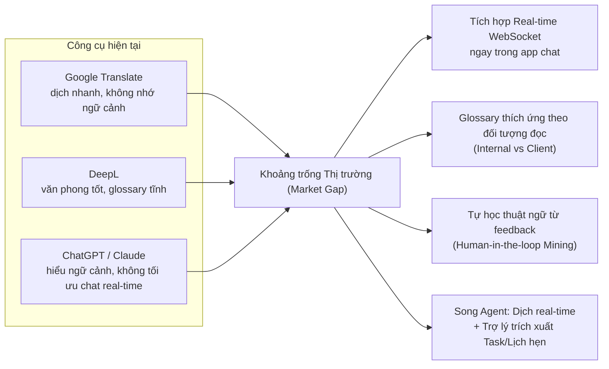
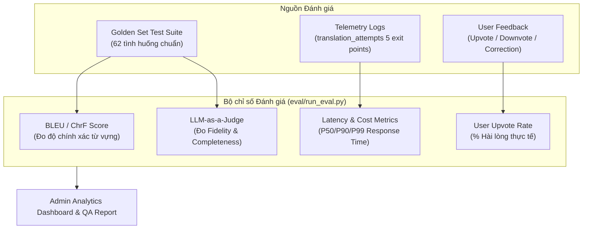

# LinguaFlow (P-217) — Trình bày Dự án & Pitch Deck Cập nhật

**Tên đề tài:** AI Agent Dịch tin nhắn đa ngôn ngữ Real-time & Trợ lý Hội thoại Thông minh  
**Nhóm thực hiện:** 4U · **Chương trình:** VinUni AI20K Build Phase  
**Phiên bản:** 3.0 — cập nhật 01/09/2026  
**Bổ sung so với 2.0:** tin nhắn thoại & phiên âm, phạm vi đọc của trợ lý, đề xuất lịch fan-out cho cả nhóm, giao diện 14 ngôn ngữ, và định hướng thương mại hoá theo khung định vị Track 1 — Day 25

---

## 📋 Mục lục

1. [Bài toán & Khảo sát Thị trường](#1-bài-toán--khảo-sát-thị-trường)
2. [Giải pháp Kỹ thuật — Kiến trúc Song Agent (Dual-Agent Architecture)](#2-giải-pháp-kỹ-thuật--kiến-trúc-song-agent-dual-agent-architecture)
3. [Kỹ thuật Xử lý các Case Khó (Advanced Edge Case Techniques)](#3-kỹ-thuật-xử-lý-các-case-khó-advanced-edge-case-techniques)
4. [Hệ thống Chấm điểm & Đánh giá (Evaluation Framework)](#4-hệ-thống-chấm-điểm--đánh-giá-evaluation-framework)
5. [Hiện trạng sản phẩm](#5-hiện-trạng-sản-phẩm-tính-đến-01092026)
6. [Hướng tới người dùng thật](#6-hướng-tới-người-dùng-thật)

---

## 1. Bài toán & Khảo sát Thị trường

### 1.1. Vấn đề thực tế (Pain Points)

Trong các phòng chat làm việc đa ngôn ngữ (Đặc biệt là phòng chat ba bên: **Quản lý dự án (PM) ↔ Lập trình viên/Designer ↔ Khách hàng quốc tế**), rào cản ngôn ngữ gây giảm hiệu suất nghiêm trọng:

| Pain Point | Tác động thực tế |
|---|---|
| **Hiểu sai ngữ cảnh & Thuật ngữ** | Các từ viết tắt kỹ thuật (`API`, `DB`, `BE`, `FE`, `PR`, `deploy`, `hotfix`) nếu dịch rời rạc theo nghĩa đen sẽ bị sai lệch specification và gây hỏng sản phẩm. |
| **Trải nghiệm dịch đứt đoạn** | Dùng Google Translate/DeepL/ChatGPT buộc người dùng phải copy-paste ra ngoài app chat, gây mất tập trung và đứt luồng thảo luận. |
| **Bỏ sót Action Items & Deadline** | Trong các luồng chat dài, các cam kết, mốc deadline và lịch hẹn dễ bị trôi mất mà không có công cụ tự động trích xuất và nhắc nhở. |
| **Rủi ro Bảo mật & Quyền riêng tư (PII)** | Khi tích hợp AI vào chat nhóm, nguy cơ lộ thông tin cá nhân (email, SĐT, số tài khoản, mật khẩu) hoặc lộ nội dung thảo luận nội bộ cho bên thứ ba. |

### 1.2. Phân tích Thị trường & Khoảng trống (Market Gap Analysis)

#### Bảng so sánh tính năng đối thủ & LinguaFlow:

| Tiêu chí | Google Translate | DeepL | ChatGPT / Claude | LinguaFlow (P-217) |
|---|:---:|:---:|:---:|:---:|
| **Dịch Real-time WebSocket** | ✗ | ✗ | ✗ | **✓ (Streaming < 1.5s)** |
| **Nhớ ngữ cảnh 3-5 tin gần nhất** | ✗ | ✗ | ✓ | **✓ (Context Injection)** |
| **Glossary theo đối tượng đọc** | ✗ | △ (Tĩnh) | ✗ | **✓ (Internal vs Client)** |
| **Tự khai phá thuật ngữ (Mining)** | ✗ | ✗ | ✗ | **✓ (Cosine Clustering + Admin Approval)** |
| **Trợ lý trích xuất Task & Lịch** | ✗ | ✗ | △ (Hỏi riêng) | **✓ (Assistant Agent + Google Calendar)** |
| **Bảo mật RAG & Consent Scope** | ✗ | ✗ | ✗ | **✓ (ADR-30 & ADR-16)** |

*(✓ = Tốt · △ = Hạn chế · ✗ = Chưa hỗ trợ)*

---

## 2. Giải pháp Kỹ thuật — Kiến trúc Song Agent (Dual-Agent Architecture)

LinguaFlow xây dựng kiến trúc **Song Agent chạy song song** trên cùng một hạ tầng (Auth, PostgreSQL + pgvector, WebSocket Gateway, Observability Tracing):

### 2.1. Agent 1: Translation Agent (Luồng Dịch thuật Real-time)

- **Đặc điểm:** Chạy tự động cho mọi tin nhắn, độ trễ thấp (mục tiêu < 1.5s), streaming token qua WebSocket.
- **Quy trình LangGraph State Machine:**
  1. **Local Detect:** Kiểm tra ngôn ngữ cục bộ (`langdetect`) ~2ms.
  2. **LLM Arbitration:** Chỉ gọi LLM phân xử khi mâu thuẫn giữa khai báo và detect.
  3. **Context Injection:** Đọc 3-5 tin nhắn gần nhất để giữ đúng mạch hội thoại.
  4. **Audience-Aware Customization:** Tra cứu Glossary theo vị thế xưng hô và đối tượng đọc (`internal` vs `client`).
  5. **2-Level Fallback:** Nếu LLM lỗi/timeout ➔ Chuyển qua `deep-translator` ➔ Nếu vẫn lỗi ➔ Trả về bản gốc an toàn với flag `is_fallback = true`.

### 2.2. Agent 2: Assistant Agent (Trợ lý Thông minh & Quản lý Tác vụ)

- **Đặc điểm:** Kích hoạt theo yêu cầu (Chat riêng với Assistant hoặc gõ `@assistant` trong chat nhóm). Trả lời riêng tư (`visibility = 'private'`).
- **Quy trình xử lý Autonomous Planner:**
  1. **Consent Verification (ADR-30):** Kiểm tra quyền đọc hội thoại của người dùng trước khi nạp tin nhắn.
  2. **RAG Memory Retrieval:** Tìm kiếm tri thức và lịch sử hội thoại liên quan qua `pgvector`.
  3. **Task & Reminder Extraction:** Trích xuất hành động, thời hạn, người phụ trách từ nội dung chat.
  4. **Human-in-the-Loop Confirmation:** Hiển thị popup xác nhận trước khi ghi dữ liệu hoặc đồng bộ Google Calendar.

- **Phạm vi đọc do nơi hỏi quyết định, không do câu hỏi:**

| Hỏi ở đâu | Trợ lý đọc được gì |
|:---|:---|
| Chat riêng với trợ lý | **Mọi hội thoại** tài khoản là thành viên, kèm danh sách thành viên từng nhóm |
| `@assistant` trong một hội thoại | **Đúng hội thoại đó**, không gì khác |

  Nhận diện luồng riêng bằng **tiêu đề** hội thoại chứ không bằng hình dạng "nhóm một thành viên" — hình dạng đó xuất hiện tự nhiên khi mọi người rời nhóm, và một nhóm rỗng dần không được phép âm thầm trở thành cửa sổ nhìn vào mọi hội thoại của người còn lại. Không xác định được thì rơi về phạm vi hẹp.

- **Một tin nhắn sinh ra đề xuất cho cả nhóm:** khi trợ lý tự phát hiện một cuộc hẹn, **mỗi thành viên nhận một hàng riêng** với trạng thái độc lập — một người duyệt không đưa lịch lên máy người khác, một người từ chối không rút lịch của người còn lại. Thời gian quy đổi **một lần theo đồng hồ người nói** rồi sao chép sang mọi hàng: "6h" là giờ treo tường của người phát ngôn, đọc lại trên đồng hồ từng người nhận sẽ dời cuộc hẹn đi đúng bằng độ lệch múi giờ.

- **Ngữ pháp thời gian do máy chủ tự tính, không tin ngày giờ model đoán:** hiểu "ngày kia", "mốt", "thứ 6 tuần sau", "chiều mai", "6 giờ rưỡi", "3pm"; và **từ chối thay vì đoán** khi gặp ngày không kèm giờ, khi chữ chọi số ("18h sáng"), hoặc khi mốc đã trôi qua. Đếm ngày là số học nên máy chủ làm; model chỉ còn việc nó giỏi — nhận ra rằng có một cuộc hẹn.

---

## 3. Kỹ thuật Xử lý các Case Khó (Advanced Edge Case Techniques)

Trong quá trình phát triển, nhóm đã áp dụng các kỹ thuật chuyên sâu để giải quyết 5 nhóm bài toán khó (Edge Cases):

### 🛠️ Case 1: Tối ưu Độ trễ (Latency) & Chi phí gọi LLM
- **Bài toán:** Gọi LLM cho mọi tin nhắn gây tăng latency (2.6s/tin) và tốn kém token.
- **Kỹ thuật xử lý:** **Tách lọc ngôn ngữ 2 tầng (2-tier Language Detection)**.
  - Tầng 1: Chạy `langdetect` cục bộ (~2ms, 0đ chi phí). Nguồn và đích trùng nhau ➔ Trả về ngay không gọi LLM.
  - Tầng 2: Chỉ khi `langdetect` mâu thuẫn với thông tin người gửi mới gọi LLM phân xử.
- **Kết quả:** Giảm latency từ **2610ms xuống 1501ms** (~42.5%), tiết kiệm hơn 35% chi phí API.

### 🛠️ Case 2: Xử lý Ngữ cảnh & Thuật ngữ theo Đối tượng đọc (Audience Awareness)
- **Bài toán:** Từ "deploy" gửi cho Dev nội bộ nên giữ nguyên `deploy`, nhưng gửi cho Khách hàng nên dịch thành `triển khai`.
- **Kỹ thuật xử lý:** **Honorific & Audience Profile Fan-out**.
  - Hệ thống lưu trữ `honorific_profile` (`senior`, `peer`, `junior`, `client`).
  - Node `customize` trong LangGraph tra cứu bảng `glossary_entries` dựa theo cặp `(source_lang, target_lang, audience)`.

### 🛠️ Case 3: Lọc Nhiễu & Tự động Đề xuất Glossary từ Chỉnh sửa Người dùng
- **Bài toán:** Người dùng sửa bản dịch nhưng có thể sửa sai, sửa ngẫu nhiên hoặc gõ nhầm.
- **Kỹ thuật xử lý:** **Semantic Embedding Clustering & Multi-user Verification**.
  - Lưu các chỉnh sửa vào `correction_log` (khi người dùng bật consent).
  - Thuật toán Offline Mining thực hiện gom cụm Vector Embeddings với độ tương đồng Cosine $\ge 0.85$.
  - **Điều kiện lọc khắt khe:** Chỉ tạo `GlossaryProposal` khi thỏa mãn đồng thời: `occurrence_count >= 3` VÀ `distinct_user_count >= 2` (phải có ít nhất 2 người khác nhau cùng sửa giống nhau).
  - Admin duyệt trên Bảng điều khiển (`/admin` GlossaryPanel) trước khi thành `GlossaryEntry` chính thức.

### 🛠️ Case 4: An toàn Quyền riêng tư & Bảo vệ PII (Guardrails & Privacy)
- **Bài toán:** Tin nhắn chứa thông tin nhạy cảm (mật khẩu, STK, email) hoặc dữ liệu riêng tư trong hội thoại nhóm.
- **Kỹ thuật xử lý:**
  - **Assistant Consent Scope (ADR-30):** Bắt buộc người dùng cấp quyền đọc hội thoại mới cho phép Assistant truy cập RAG context.
  - **Privacy-Preserving Telemetry (ADR-16):** Mọi log tracing (Braintrust/Langfuse) và log lỗi hệ thống đều được làm sạch, mask PII, chỉ ghi nhận metadata (token count, latency, error code) không lưu trữ văn bản thô của người dùng.

### 🛠️ Case 5: Đảm bảo Hệ thống Không Bao giờ Cắt đứt Hội thoại (Zero-Crash Resilience)
- **Bài toán:** LLM Provider (Groq/DeepSeek) bị rate-limit, timeout hoặc ngắt kết nối.
- **Kỹ thuật xử lý:** **2-Level Graceful Fallback Architecture**.
  - Tầng 1: Tự động chuyển hướng sang Provider dự phòng (`deep-translator`).
  - Tầng 2: Nếu cả tầng dự phòng thất bại ➔ Trả về nguyên bản tin nhắn ban đầu kèm flag `is_fallback = true` và ghi log telemetry tại điểm thoát. Chat vẫy chạy liên tục, không bao giờ vỡ UI.

---

## 4. Hệ thống Chấm điểm & Đánh giá (Evaluation Framework)

Dự án LinguaFlow áp dụng hệ thống đánh giá đa chiều kết hợp giữa **Tự động hóa (Automated Benchmarking)**, **LLM-as-a-Judge** và **Phản hồi Người dùng thật (Human Feedback)**:

### 4.1. Bộ Đánh giá Golden Set (`eval/golden_set.jsonl`)
- Gồm **62+ kịch bản kiểm thử có nhãn**, bao gồm:
  - Dịch thuật ngữ IT / Software Outsourcing.
  - Dịch câu ngắn, từ lóng, viết tắt (`FE`, `BE`, `PR`, `LGTM`).
  - Khả năng xử lý xưng hô theo vị thế (`senior`, `client`).
  - Xử lý tin nhắn chứa ký tự đặc biệt, đoạn code.

### 4.2. Bộ Chỉ số Đánh giá (Evaluation Metrics)

1. **Điểm BLEU / ChrF:** So sánh bản dịch đầu ra với bản dịch chuẩn (Reference Translation).
2. **Điểm Fidelity & Completeness (LLM-as-a-Judge):** Đánh giá xem bản dịch có giữ nguyên ý nghĩa cốt lõi và không bỏ sót các thông tin kỹ thuật quan trọng hay không (thang điểm 1 - 5).
3. **Chỉ số Telemetry (5 Exit Points Tracking):** Theo dõi tỷ lệ thành công của LLM chính, tỷ lệ chuyển qua Fallback, và tỷ lệ trả về tin nhắn gốc.
4. **User Upvote/Downvote Ratio:** Thống kê từ `POST /api/v1/translations/{id}/feedback` và `GET /api/v1/admin/feedback` để đo tỷ lệ hài lòng thực tế của người dùng.

---

## 5. Hiện trạng sản phẩm (tính đến 01/09/2026)

Phần này liệt kê **những gì chạy được trên bản dựng hiện tại**, kèm nơi kiểm chứng. Các mục chưa đạt được ghi thẳng ở §5.4 thay vì làm tròn lên.

### 5.1. Ma trận tính năng đã nghiệm thu

| Mã | Tính năng | Trạng thái | Nơi kiểm chứng |
|:---:|:---|:---:|:---|
| **F-01** | Xác thực JWT, OTP đăng ký, đặt ngôn ngữ dịch & ngôn ngữ giao diện | ✅ | `src/api/routes.py`, `tests/test_api/test_auth.py` (23 test) |
| **F-02** | Chat real-time 1-1 và nhóm qua WebSocket | ✅ | `src/api/websocket.py`, `src/services/connection_manager.py` |
| **F-03** | Dịch có ngữ cảnh, phát hiện ngôn ngữ hai tầng, fallback 2 mức | ✅ | `src/agents/graph.py`, `src/agents/nodes/translation.py` |
| **F-04** | Bật/tắt bản gốc — bản dịch trên từng tin nhắn | ✅ | `frontend/src/features/chat/components/MessageBubble.tsx` |
| **F-05** | Human-in-the-loop: upvote/downvote và sửa bản dịch | ✅ | `src/services/correction_log.py` |
| **F-06** | Guardrail đầu vào/đầu ra, giới hạn độ dài, chống giả mạo thẻ ngữ cảnh | ✅ | `src/agents/guardrails.py`, `docs/GUARDRAILS.md` |
| **F-07** | Khai phá thuật ngữ tự động + bảng duyệt của quản trị | ✅ | `src/services/glossary_mining.py` |
| **F-08** | Assistant Agent: RAG riêng, trích việc, lịch cá nhân, đồng bộ Google Calendar | ✅ | `src/agents/assistant/`, `src/services/calendar.py` |
| **F-09** | Tin nhắn thoại: ghi âm → phiên âm (Gemini STT) → dịch → trích việc | ✅ | `src/services/voice_transcription.py`, `src/services/audio_conversion.py` |
| **F-10** | Gọi thoại/video 1-1 qua WebRTC | ✅ | `src/services/rtc.py` |
| **F-11** | Giao diện 14 ngôn ngữ theo cài đặt tài khoản | ✅ | `frontend/src/features/chat/i18n.ts` (576 khóa), `scripts/check_ui_keys.py` |

### 5.2. Bốn quyết định về hành vi, đã chốt và đã kiểm chứng chạy thật

Đây là phần khác biệt lớn nhất so với bản trình bày trước, và cũng là phần khó nhất về mặt thiết kế — không phải thêm tính năng, mà là **trả lời cho đúng câu hỏi "cái này thuộc về ai"**.

| Câu hỏi | Câu trả lời đã chốt | Vì sao |
|:---|:---|:---|
| Đề xuất lịch hiện cho ai? | **Mọi thành viên hội thoại**, mỗi người một hàng riêng, duyệt/từ chối độc lập | Một cuộc hẹn là việc của tất cả người có mặt; một hàng dùng chung không diễn đạt được "hai người duyệt, người thứ ba từ chối" |
| Trợ lý được đọc gì? | Chat riêng: **toàn bộ hội thoại** của tài khoản. Tag trong nhóm: **đúng hội thoại đó** | Cuộc hẹn nằm rải ở nơi người ta hẹn nhau; trợ lý bị giam trong luồng riêng thì luôn trả lời "không thấy gì" |
| Trợ lý trả lời bằng ngôn ngữ nào? | **Ngôn ngữ của câu hỏi** | Người cài tiếng Anh mà gõ tiếng Việt là đã chọn tiếng Việt bằng cách gõ nó |
| Chữ trên màn hình theo cài đặt nào? | Chrome + ngày giờ + hộp nhiệm vụ → `interface_language`. Nội dung trong luồng chat → `preferred_language` | Hai cài đặt khác nhau; nhầm chúng làm cả cột trái đứng yên khi đổi ngôn ngữ |

Bốn điều trên được **kiểm chứng bằng cách chạy hệ thống thật**, không chỉ bằng test: 20/20 hạng mục đạt, gồm cả trường hợp một tin nhắn thoại tiếng Việt tạo ra đề xuất cho hai người bằng hai ngôn ngữ khác nhau, và mốc "chiều thứ Sáu tuần sau lúc 3 giờ" được quy đổi đúng thành 15:00 thứ Sáu theo múi giờ người nói.

### 5.3. Kiểm thử tự động

| Bộ | Số lượng | Kết quả |
|:---|:---:|:---|
| Backend (`pytest tests/`) | **1236** | toàn bộ đạt, ~22 phút |
| Frontend (`vitest`) | **53** | toàn bộ đạt |
| Kiểu tĩnh (`tsc --noEmit`) | — | 0 lỗi |
| Lint (`ruff`, `eslint`) | — | 0 lỗi |
| Migration | 38 revision | một `head` duy nhất |

### 5.4. Kết quả đánh giá chất lượng dịch — kể cả phần chưa đạt

Chạy trên `eval/golden_set.jsonl` (62 mẫu), chấm bằng LLM-as-judge (`mistral-medium` chấm `gemini-3.7-flash`):

| Chỉ số | Mục tiêu | Thực tế | |
|:---|:---:|:---:|:---|
| Tỷ lệ đạt (≥ 0.7) | > 80% | **100%** | đạt |
| Điểm trung bình | > 0.80 | **0.912** | đạt |
| chrF++ / BLEU / TER | — | 65.6 / 52.2 / 56.9 | đạt |
| Tuân thủ glossary | 100% | **100%** | đạt |
| Số lần fallback | 0 | **0** | đạt |
| **Độ trễ trung bình** | < 1000ms | **2324ms** | **chưa đạt** |
| **Độ trễ p95** | < 2000ms | **4608ms** | **chưa đạt** |
| **Đúng ngôn ngữ đích** | 100% | **96,6%** | **chưa đạt** |

Ba dòng cuối là nợ kỹ thuật đã biết, không phải sai số đo. Độ trễ bị chi phối bởi nhà cung cấp LLM; con số 96,6% nghĩa là **cứ khoảng 30 tin nhắn thì có 1 tin trả về sai ngôn ngữ đích** — với một sản phẩm dịch thuật thì đó là chỉ số phải chốt trước khi có người dùng thật.

### 5.5. Hình dạng bản triển khai

Khác với bản trình bày trước, hệ thống **không còn chạy trên Vercel/Railway**. `docs/DEPLOY.md` nêu rõ không dùng lại hướng dẫn cũ.

| Thành phần | Nơi chạy |
|:---|:---|
| Backend + Agent | Ubuntu VPS, container GHCR dựng sẵn, **đúng một bản sao** |
| Cơ sở dữ liệu | `pgvector/pgvector:pg16` trên cùng VPS, volume bền vững |
| Frontend | Ubuntu VPS, container GHCR sau Caddy |
| Quan sát | Braintrust (mặc định) hoặc Langfuse, đổi bằng biến môi trường |

> **Ràng buộc quan trọng (ADR-18):** `ConnectionManager` giữ socket trong bộ nhớ tiến trình. Bản sao thứ hai sẽ nhận một nửa kết nối và **âm thầm đánh rơi** tin nhắn phát cho nửa còn lại. Không `--workers`, không autoscale, cho tới khi có backplane dùng chung.

---

## 6. Hướng tới người dùng thật

Phần này bám khung định vị đã làm ở **Track 1 — Day 25 (Monetization Lab)** cho chính LinguaFlow, thay vì dựng lại một lộ trình chung chung.

### 6.1. Định vị đã chọn: bán kết quả, không bán phần mềm

Day 25 so sánh hai khung và **chọn khung B**:

| | Khung A — Phần mềm | **Khung B — Thay thế công việc (đã chọn)** |
|:---|:---|:---|
| Cách nói | "Phần mềm trợ lý AI dịch họp và ghi biên bản" | "Đảm bảo 100% cuộc họp đa quốc gia được dịch chuẩn, biên bản & task giao đúng hạn" |
| Người quyết chi | IT Director | **COO / Head of Operations** |
| Lấy từ ngân sách | SaaS | **Nhân sự / Vận hành** |
| Bị so với | Zoom AI Companion ($0), Teams Premium ($10/user) | Thuê phiên dịch part-time ($600–1.000/tháng) |
| Phản đối lớn nhất | "Đã có Zoom/Teams miễn phí rồi" | "AI dịch sai gây thiệt hại hợp đồng thì ai chịu?" |

Lý do chọn B: ngân sách vận hành lớn và linh hoạt hơn ngân sách SaaS, vốn bị đọ giá trực tiếp với một sản phẩm giá $0 tích hợp sẵn.

**Hệ quả cho kỹ thuật — và đây là chỗ sản phẩm hiện tại đã đi đúng hướng:** phản đối lớn nhất của khung B là trách nhiệm khi AI sai. Ba thứ đã có trong bản dựng này trả lời trực tiếp câu đó:

- **Không có ghi tự động.** Mọi thứ trợ lý muốn đưa lên lịch đều thành `action_proposal` chờ người duyệt, có thể sửa tiêu đề/giờ/mức nhắc ngay tại chỗ (ADR-30, ADR-34).
- **Không đoán múi giờ.** `normalize_action_time` từ chối mọi mốc giờ treo tường khi chưa có múi giờ đáng tin, thay vì đặt nhầm giờ mà không báo.
- **Log đầy đủ để quy trách nhiệm.** `translation_attempts` ghi cả 5 lối thoát, kể cả 4 lối không sinh ra bản dịch — đây chính là điều kiện để chấm Attribution 8/10 ở Day 25.

### 6.2. Đơn vị tính tiền: một "Completed Job"

Day 25 định nghĩa: *một workflow xuyên biên giới (15–60 phút) được dịch real-time, tóm tắt và trích xuất action item **thành công, không cần người sửa lại***.

Mô hình đề xuất là **Outcome-based** (Attribution 8/10 × Autonomy cao), giá $1,50/completed meeting, với ngưỡng hòa vốn:

| Containment | Cost/Completed Job | Gross Margin | |
|:---:|:---:|:---:|:---|
| 60,0% | $0,6240 | 58,4% | cảnh báo |
| **71,63%** | $0,6000 | **60,0%** | ngưỡng hòa vốn |
| **82,0%** (đo thực) | **$0,4102** | **72,65%** | an toàn |

**Nhưng con số 82% đó đến từ eval của Day 21–22, chưa phải từ người dùng thật.** Việc đầu tiên khi có người dùng là đo lại containment thật và đối chiếu với ngưỡng 71,63% — dưới ngưỡng đó thì mô hình giá không còn lãi lành mạnh.

### 6.3. Ba việc phải làm trước khi mời người dùng thật

Xếp theo thứ tự rủi ro, không theo thứ tự dễ làm.

**1. Chốt 96,6% → 100% đúng ngôn ngữ đích.** Một sản phẩm dịch thuật trả sai ngôn ngữ 1/30 lần là hỏng đúng lời hứa cốt lõi. Cơ chế đã có (`guardrails.verify_output_language`); việc còn lại là siết vòng kiểm và quyết định: sai ngôn ngữ thì thử lại hay trả nguyên văn.

**2. Bỏ giới hạn một bản sao.** ADR-18 chặn autoscale vì socket nằm trong bộ nhớ tiến trình. Với người dùng thật thì đây vừa là trần công suất vừa là điểm chết đơn lẻ — cần backplane dùng chung (Redis pub/sub) trước khi mở rộng.

**3. Xử lý timeout im lặng của luồng phát hiện cam kết.** `LLM_TIMEOUT_SECONDS=10`; khi nhà cung cấp chậm hơn, tác vụ nền thất bại **không có thông báo nào** — người dùng chỉ thấy đề xuất không hiện ra. Quan sát được trong lúc chạy thử ngày 01/09. Cần retry có chủ đích hoặc một dấu hiệu nhìn thấy được.

### 6.4. Kênh 90 ngày đầu: Partner-Led

Day 25 kiểm tra khả năng chi trả và loại Sales-Led: với ARPU $200/tháng và biên 72,65%, CAC thực tế của kênh có sales **vượt ngân sách 14,45 lần**.

Kênh chốt là **Partner-Led** qua liên minh tư vấn chuyển đổi số & IT Outsourcing (FPT Digital, Rikkei Soft, VNITO Alliance), chia sẻ 25% doanh thu. Bề mặt tích hợp mục tiêu: **Google Meet Chrome Extension** và **Zoom App Bot**, xuất biên bản & action item thẳng vào Slack/Notion của doanh nghiệp.

Khoảng cách kỹ thuật giữa bản hiện tại và bề mặt đó là rõ ràng: LinguaFlow hôm nay là một ứng dụng chat độc lập; để vào được cuộc họp Meet/Zoom cần một lớp bot tham gia phòng họp và nhận luồng audio — hạ tầng phiên âm và trích việc thì đã sẵn sàng, phần thiếu là đường vào.

### 6.5. Nâng cấp hệ thống hiện có

- **Đồng bộ hai chiều Google Calendar** đã có một chiều (đẩy lên) và pull định kỳ 300s; cần webhook để sự kiện đổi bên Google phản ánh ngược lại tức thì.
- **Ranh giới dữ liệu Admin/User**: quản trị xem chi phí, token, duyệt thuật ngữ — **không bao giờ đọc nội dung chat thô**. `message_visibility.public_only()` đã là nền cho việc này.
- **Bảng điều khiển chất lượng**: trực quan hóa xu hướng chrF++/BLEU, tỷ lệ upvote, chi phí token theo ngày và theo model, hiệu suất đề xuất glossary.
- **Mở rộng grammar thời gian**: hiện đã hiểu "ngày kia", "thứ 6 tuần sau", "6 giờ rưỡi", "3pm"; chưa hiểu mốc chỉ có giờ mà không có ngày, và chưa hiểu tiếng Việt không dấu.
